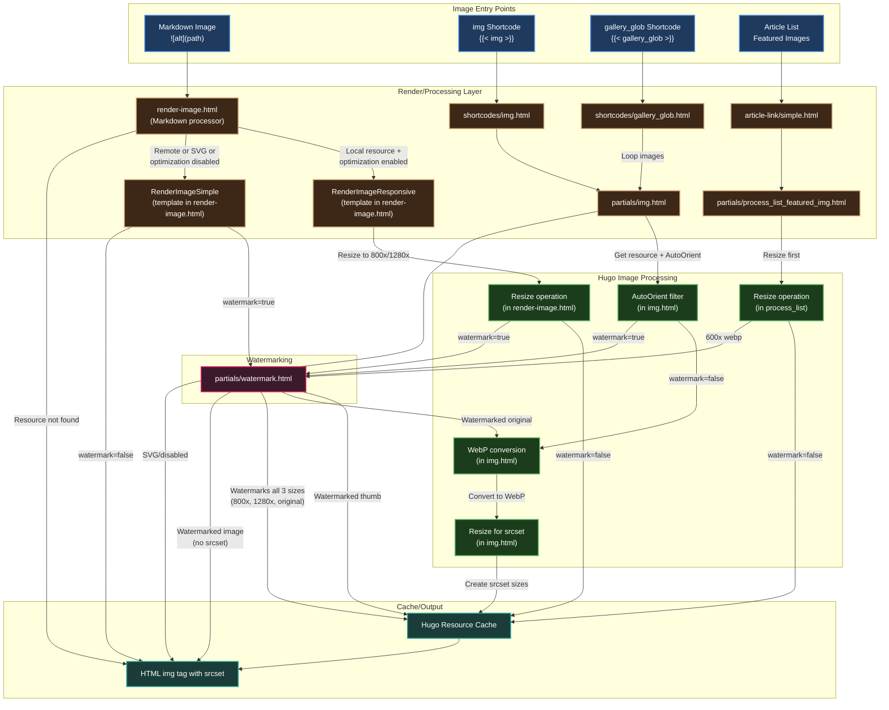

# blog.tiga.tech

[tig's Blog](https://blog.tiga.tech), powered by [Hugo](https://gohugo.io/) and [Blowfish](https://github.com/nunocoracao/blowfish).

## Shortcodes

| Shortcode                           | Description                                                                                     |
| ----------------------------------- | ----------------------------------------------------------------------------------------------- |
| [**`gallery_glob`**](#gallery_glob) | Builds a gallery from a glob pattern, and applies image optimisation and optional watermarking. |
| [**`img`**](#img)                   | Custom image shortcode that integrates with image optimisation and watermarking.                |
| [**`spoiler`**](#spoiler)           | Toggles visibility of content. Useful for hiding spoilers or long sections of text.             |
| [**`tooltip`**](#tooltip)           | Adds an on-hover, pop-up tooltip above a given piece of text.                                    |

### `gallery_glob`

Build a gallery of statically-sized images (as opposed to [Blowfish's gallery shortcode](https://blowfish.page/docs/shortcodes/#gallery) where the size of each image is configurable) from a file path glob.

* Outputs a clean, consistent layout with an optional caption.
* Through usage of the included [`img`](layouts/partials/img.html) partial (usage of `img` as a shortcode is [documented below](#img)), this shortcode will:
  * Support image processing and optimisation.
  * Automatically apply watermarking unless disabled.

**Parameters:**
* `images` (required, str): Path glob (relative to current path) of images to include.
* `class` (required, str): Class to apply to all images (e.g. `grid-w50`, `grid-w50 md:grid-w33`, etc.). See [Blowfish's gallery shortcode docs](https://blowfish.page/docs/shortcodes/#gallery) for more info.
* `caption` (optional, str): Optional caption to display below the gallery. Supports markdown.

**Example:** ``

### `img`

Display an image with optional watermarking and image optimisation.

**Parameters:**
* `src` (required, str): The image path.
* `class` (optional, str): Custom CSS classes for styling the image. Defaults to `grid-w100`.
* `alt` (optional, str): Alternative text for the image.
* `watermark` (optional, bool): Control whether watermarking is applied (default: true).
* `watermark_position` (optional, str): Choose a watermark position. Choices: `left`, `centre` (default), `right`.

**Example:** ``

### `spoiler`

Toggle visibility of content, useful for spoilers or collapsible sections.

**Parameters:**
* `title` (required, str): The title displayed for the toggle.
* `open` (optional, str): Whether the content is initially visible (default: false).

**Example:** `This is hidden content.`

### `tooltip`

Adds an on-hover pop-up tooltip above a given piece of text.

**Parameters:**
* `text` (required, str): The text to show in-line.
* `tip` (required, str): The tooltip text to show on hover.

**Example:** ``

> [!NOTE]
> This depends on some custom CSS. Search [assets/css/custom.css](assets/css/custom.css) for `Text tooltip style`.

## Featured image watermarking in article lists

If [`list.cardView`](https://blowfish.page/docs/configuration/#list) is `false`, each post's featured image will be watermarked using the [process_list_featured_img](layouts/partials/process_list_featured_img.html) partial.

This can be disabled per-page with by setting the `hideFeatureWatermark` page parameter to `false`.

<details>
  <summary>Implementation detail</summary>

  This works by overriding Blowfish's [`layouts/partials/article-link/simple.html`](https://github.com/nunocoracao/blowfish/blob/main/layouts/partials/article-link/simple.html) and moving all featured image processing to my [`process_list_featured_img`](layouts/partials/process_list_featured_img.html) partial, which handles watermarking and conditional image optimisation.
</details>

## Using images in posts

> [!NOTE]
> When an image is passed through the [`watermark` partial](layouts/partials/watermark.html), it will be watermarked **unless** the image path/URL contains `watermark`.

| Method                                                                                     | Description                                    |
| ------------------------------------------------------------------------------------------ | ---------------------------------------------- |
| ` src="image-path" class="image classes" alt="alt text"`                              | Adds the image directly, skips all processing. |
| ``                                                              | Markdown syntax, image is processed according to site's image optimisation config and passed through `watermark` partial.<br>Watermarking can be disabled by appending `no-wm` to the alt text (e.g. ``) |
| ``  | Custom shortcode, image is optimised and passed through `watermark` partial.<br>Images are optimised by means of Hugo's [`Resize`](https://gohugo.io/methods/resource/resize/) method and HTML's `img` tag `srcset` attribute. The image passed in the `src` attribute is resized to 660x by default if the original is larger.<br>Images are watermarked if `watermark` is not false (default true). |
| ` ... `                                                     | [Blowfish gallery shortcode](https://blowfish.page/docs/shortcodes/#gallery), images are processed based on method used to add include them.<br>See rows above for image inclusion methods. |
| `` | Builds a gallery from a glob pattern.<br>Passes images through `img` shortcode and inheriting its features. |

### Image Processing Pipeline

> [!IMPORTANT]
> There may be some inaccuracies, this diagram was AI-generated.



## Personal Notes

* [Blowfish built-in shortcodes](https://blowfish.page/docs/shortcodes/).
* [Blowfish built-in icons](https://blowfish.page/samples/icons/).
* Obfuscate vehicle numberplate:
  ```sh
  if [ ! -d number_plate_obfuscator/.venv ]; then
    python3 -m venv number_plate_obfuscator/.venv
    source number_plate_obfuscator/.venv/bin/activate
    pip install -r number_plate_obfuscator/requirements.txt
  else
    source number_plate_obfuscator/.venv/bin/activate
  fi
  # For a single image:
  number_plate_obfuscator/main.py -s <image path>
  # Or for a directory of images:
  for i in `find <images dir path> -type f`; do number_plate_obfuscator/main.py -s $i ; done
  ```
* Post thumbnails are cropped to a 1.67:1 aspect ratio (e.g. 300x180) and anchored to centre to fit the bounding box on article list pages.
* Sometimes the [EXIF script](scripts/strip_exif.sh) will reset the original rotation defined in the orientation tag. Obviously this is a bug that needs to be fixed, but until I can be arsed, orientation data can be re-applied like so: `exiftool -orientation="Rotate 90 CW" img.png` ([source](https://exiftool.org/forum/index.php?topic=7909.0)).

### TODOs

* should convert to webp as part of the image optimisation process
* more imaging things [here](https://gohugo.io/content-management/image-processing/#resampling-filter) and [here](https://gohugo.io/content-management/image-processing/#processing-options)
* test if md `` works. If not, it's probably [render-image.html](layouts/_default/_markup/render-image.html)
* add spotify info on main page... might need some hacks though 🙃 https://github.com/BehnH/spotify-workers

Would be handy to use some of these debug shortcodes:
https://github.com/marcus-crane/utf9k/tree/370daacc49ce16012a2ed53d326b931b03e63269/content/debug
https://utf9k.net/blog/hugo-debug-reports/

and this to maintain code snippets as separate files:
https://kubernetes.io/docs/contribute/style/hugo-shortcodes/#source-code-files
https://github.com/kubernetes/website/blob/main/layouts/shortcodes/code.html

look at these potentially useful shortcodes:
* <https://github.com/rvanhorn/hugo-dynamic-tabs>
* <https://github.com/statropy/github-button-hugo-shortcode>
* Well useful <https://github.com/kaushalmodi/hugo-debugprint>

* Images in gallery are in the middle of other elements on first load. After reloading, it's fine.

## Upgrading

1. Upgrade theme and check Hugo version: `scripts/update_blowfish.sh`
   - This will automatically install the correct Hugo version if needed.
2. If required, manually install a specific Hugo version: `scripts/install_hugo.sh <version>`
   - Example: `scripts/install_hugo.sh 0.152.2`
   - Omit version to install the latest: `scripts/install_hugo.sh`

Update `number_plate_obfuscator`: `git submodule update --remote number_plate_obfuscator`
