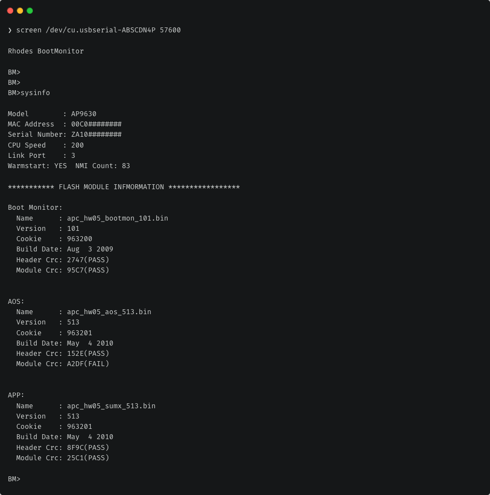

In this post, I'll walk through the steps I had to take to recover an APC AP9630 Network Management Card (NMC) (a.k.a NMC2) with corrupted or otherwise broken firmware back to a working state.


The steps are largely similar for the NMC3 (AP964x etc.), but I make no guarantees as I have no personal experience with them.


Feel free to skip straight to [Recovering the NMC](#recovering-the-nmc) if you don't care for the preceding 70% troubleshooting & discovery process, 30% rant.

## Preamble

I recently purchased a used AP9630 NMC from an eBay seller. Unfortunately, upon arrival, it appeared to be non-functional.

This was one of the most frustrating troubleshooting processes I've been through in quite a while. APC's poor documentation and general shithousery only served to worsen the experience. Granted, though, this is par for the course when it comes to APC.

I'm a big fan of APC's equipment, but there are few companies whose practices cause me more silent rage than APC's (Broadcom is definitely near the top of that list, though).

When I received the NMC, I was excited to get going and swiftly fitted it into my APC SMT1500i UPS. Per my research, I knew that I should be able to configure the NMC's network settings from my UPS's front panel controls. I was quite glad of this as I'd messed with several pieces of older, second-hand APC equipment in the past and usually been forced to purchase one of their ridiculous, over-priced, proprietary serial cables.

This is typically a requirement to configure network settings and gain access to the web UI, SSH, etc. since it's apparently rather rare that a seller of used equipment has the foresight to reset to factory defaults. If they did, this would allow it to boot straight into DHCP mode upon first use in its new home.

Anyway, I digress. Once installed in my UPS, I noticed that the status LED was flashing amber. My research showed me this meant it was in BOOTP/DHCP mode, which would later prove to be untrue but I didn't know this yet.  
I'd already provisioned a DHCP reservation for it, so I attempted to reach it on the expected IP address, but sadly to no avail.

I contacted the seller to ask if they knew the IP address it was configured with. To my surprise they responded quickly, telling me it should be somewhere in the 172.16.250-253 range. Unfortunately, I also had no luck with any of these addresses.

In hindsight, I was seeing some pretty strong indicators that something wasn't right here:
* I believed the status LED indicated that was in DHCP mode, but it wasn't picking up an address.
* It wasn't available on any of the IP addresses that the seller suggested it had been configured with.

However, not seeing clearly through the frustration, I continued down the wrong path; in an attempt to avoid paying a frankly ridiculous sum of money for one of APC's proprietary serial cables, I attempted to build my own.

The serial cable required is an APC 940-0299. I found the pinout [here](https://pinoutguide.com/UPS/apc_management_card_pinout.shtml). Using a 2.5mm-3.5mm TRS adaptor and a 3.5mm male-to-male cable, I cut one end off the 3.5mm cable and wired it into a USB serial adaptor. This was super janky, and I loved it.

However, in keeping with the running theme here, it didn't work. Connecting with 9600bps/8b data/1b stop/no parity/no flow ctrl yielded nothing but an empty, black box. I followed all the instructions, pressing the reset button for various lengths of time, timing it with different responses from the status LED, so on and so forth. The empty, black box remained unchanged.

Fuck it, I bit the bullet and bought a 2.5mm-USB APC serial adaptor. It wasn't official, but it had a bunch of good reviews so I was happy to take the risk. I also don't have anything with a DB9 serial port that isn't buried under boxes, so an official APC cable wouldn't have been of much use anyway.

It arrived the following day. It didn't work. I was ready to break this NMC in two and throw it back into the fiery pits of hell from which it clearly came.

With a healthy dose of copium keeping me going, I assumed the cable was simply the problem here. I initiated a return and purchased another one.

Yet another day later, I received the new cable. It didn't work.

Barely managing to stop myself from punting the bloody thing into the sea, I fell back to further research.

In a stroke of luck, I came across a Schneider Electric (SE) (APC's parent company) forum post where a had similar symptoms and mentioned that their NMC's status LED was flashing amber at a faster rate than was expected for DHCP mode. This was also the case for me, but I'd thought little of it beforehand. This silly little assumption was the cause of all my pain.

A SE representative stated the faster amber flash, approx. 2x/second, suggested it was in "boot monitor" (BM) mode. This is indicative of a fatal firmware (FW) failure or FW corruption.

In order to access BM mode, you must connect via serial with 57600bps/8b data/1b stop/no parity/no flow ctrl.



Finally, a very minor success! 🙄 Time to begin recovery. Thankfully, the SE representative had also covered some basic steps in their response. Paired with some KB articles and further forum posts, I managed to compile the steps for a full recovery.

## Recovering the NMC

### Prerequisites

#### CLI Tools

In the next steps, we'll be using the following CLI tools:
* `screen`
* `unzip`
* `lrzsz`

These are available in almost all default package manager repositories, including `apt`, `brew`, and more. In this case I'm using `brew`, since I'm on macOS.

#### Firmware Binaries

Yes, binaries, plural.

The APC NMCs have 3 individual firmwares onboard:
* boot monitor (BM/bootmon), approximately equivalent to a BIOS as far as I understand.
* AOS, I assume short for APC Operating System (OS).
* APP (Application Module), which is different depending on the brand of UPS you're using (e.g. APC or Symmetra).

I downloaded the latest firmware from [here](https://www.se.com/uk/en/product/AP9630/apc-ups-network-management-card-2/). At the time of writing, the latest version is 7.1.8:


Since two are offered, you must ensure you download the correct package for your brand of UPS.

When downloading the firmware, you have the choice to download a ZIP with all files bundled, or individual files. You only need the EXE file unless you're interested in the release notes PDF.


The EXE is a self-extracting archive. Mildly frustrating for anyone not using Windows, but not a problem as it's still basically just a ZIP file:


After extracting the firmware, you should see a `Bins` directory in your extract path with several `bin` and `lpk` files, as shown above.

The `bin` files are the ones we want here. You should have a `bin` file for each of the firmware NMC's components: `bootmon`, `aos`, and a third for the application module (`app`).  
The `app` firmware binary is named depending on your UPS type (for example this could be `sumx`, `sy`, `sy3p`, or something else) as described above.

For NMC2 firmware version 7.1.8 I had the following `bin` files:
* `apc_hw05_bootmon_109.bin` - Bootmon
* `apc_hw05_aos_718.bin` - AOS
* `apc_hw05_sumx_718.bin` - Application module

### Connecting to the NMC

With your APC 940-0299 or equivalent serial cable connected to the NMC and your machine, you can now connect with the following settings:

| Baud rate | Data Bits | Stop Bits | Parity | Flow Control |
|-----------|-----------|-----------|--------|--------------|
| 57600     | 8         | 1         | None   | None         |


The baud rate is 9600 for NMC3 (AP964x etc.) models.


Unless you have a more preferred method, you can connect to the serial port like so: `screen /dev/<serial device> <baud rate>`.

For example, I ran `screen /dev/cu.usbserial-ABSCDN4P 57600`.

According to the documentation[^1], you now need to press the reset button through the pinhole on the NMC and then mash return on your keyboard.  
For me, this wasn't actually necessary; I simply connected, hit return, and instantly received a `BM>` prompt, indicating the NMC was in boot monitor (BM) mode.

Once you receive the `BM>` prompt, you know for sure that your NMC is in BM mode and has experienced some form of unrecoverable firmware failure.

If you can't get the prompt, double check your physical connections and serial terminal settings.  
You could also try connecting with a baud rate of 9600. While this is the baud rate for the BM on the NMC3, it's also the baud rate for AOS on the NMC2. So, if you have a NMC2 and this works, you're likely in luck and have nothing more to do! 🎉

### Flashing Firmware to the NMC

Before anything else, I'd recommend you `cd` to the `Bins` directory in your firmware files extract path from the [Firmware Binaries](#firmware-binaries) section.

The order in which these files are flash is **very important**:
1. `bootmon`
2. `aos`
3. `appmon`

We'll flash the firmware using the XMODEM file transfer protocol. The NMC's BM mode has native support for this.

First, ensure you have `lrzsz` installed as described in the [CLI Tools](#cli-tools) section.

The rest of this process assumes you are using `screen` for the serial connection.

1. Connect to the NMC via serial as described above.
2. Run `sysinfo` and keep a copy of the output. You may find this useful later for comparison purposes.
3. The APC documentation[^1] suggests you first perform a factory reset, however this is only available on BM version >=1.0.8. In my case this option wasn't available.
    1. To perform the factory reset on BM version >=1.0.8, run the following commands:
    2. `factory_reset` - A confirmation prompt will follow.
    3. Run `factory_reset_confirm` to complete the reset process.
    4. Once complete, you should see a `BM>` prompt.
3. Run `XMODEM`. It may look like it's done nothing, but you will shortly see `C`'s being printed.  
   For example, after a few seconds, my prompt looked like this: `BM>XMODEMCCCCCCCC`
4. Now transfer the first binary, `bootmon`, like so:
    1. Press `CTRL+A`
    2. Press `:` (colon)
    3. Type `exec !! lsz -X apc_hwXX_bootmon_XXX.bin`, replacing the `X`'s to match your `bootmon` binary's filename.
    4. You should now see something such as the following in your session, with the sent sectors/kbytes gradually increasing:  
       ```
       Sending apc_hw05_bootmon_109.bin, 2048 blocks: Give your local XMODEM receive command now.
       Xmodem sectors/kbytes sent: 356/44k
       ```
5. Once complete, you should see the following message:
   ```
   Rhodes BootMonitor
                XMODEM Successfully Completed
   BM>
   ```
   You may need to press return to get the `BM>` prompt.
   If you wish, you can now run `sysinfo` again to confirm the firmware has been correctly applied (assuming it wasn't already on the latest version beforehand).
6. Repeat the process in steps 4-5 for the remaining 2 binaries.
7. Assuming the previous steps were successful, you can now optionally perform a factory reset per the process in steps 3.2-3.4.
8. Run `boot` to instruct the NMC to continue the boot process into AOS and load the application module.

After the final step, you will instantly lose access to the serial session and should see the device appear on the network shortly after!

If you didn't perform a factory reset, the device isn't in DHCP mode, and you are unsure of the NMC's IP address, you can now connect to AOS via serial with the following settings:

| Baud rate | Data Bits | Stop Bits | Parity | Flow Control |
|-----------|-----------|-----------|--------|--------------|
| 9600      | 8         | 1         | None   | None         |

---

I always welcome feedback on my posts, please [contact me](/contact) if you have any. I'm also happy to answer any related questions if I know the answer.

[^1]: https://www.apc.com/us/en/faqs/FA293874/
