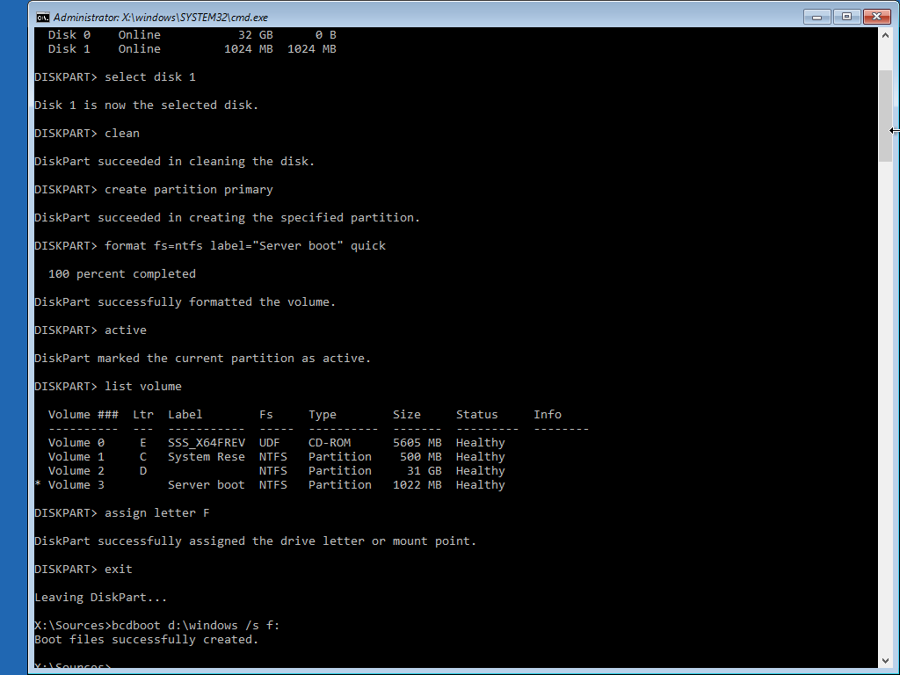

+++
draft = true
date = 2019-12-03T00:00:00+01:00
title = "Boot Windows from the ODD port on the HPE Microserver Gen8"
description = "In this post, we'll learn how to get Windows booting from a disk attached to the ODD port of a HP MicroServer Gen8."
slug = "boot-windows-odd-port-microserver-gen8"
authors = ["tigattack"]
tags = ["windows", "microserver"]
categories = ["technology"]
series = []
+++

A lot of people, including myself, have had issues with booting from storage devices connected in the ODD bay when the server is in AHCI mode.
After working on this for a while, I have managed to devise a solution.

This is sort of a follow-up to my post on [Installing Windows Server on the HPE Microserver G8 in AHCI mode](../installing-windows-server-on-the-hpe-microserver-g8-in-ahci-mode/)

---

1. Get a MicroSD card or USB stick and install it in the port inside the server.
2. Boot to Windows.  
  If the OS disk is already in the ODD bay, you'll need to remove all other SATA devices before attempting to boot, otherwise it'll try to boot from those instead.
3. Mount or connect your installation media.
4. Open a Command Prompt.
5. Run the following commands to make the MicroSD/USB stick bootable. Replace \<X> with the current drive letter of your MicroSD/USB stick.

```cmd
    diskpart
    list disk
    select disk <X>
    clean
    create partition primary
    active
    format fs=ntfs label="Windows Server boot" quick
```

6. Identify the letter that's been assigned to your MicroSD/USB stick and copy the BCD to the new partition:
    * Run `list volume` and note the letter for the volume that you installed Windows on.
    * `exit`
    * `bcdboot <C>:\windows /s <B>:` (where `<C>` is your Windows volume. Refer to step 3 for `<B>`)
7. Set the boot option in the server's BIOS to USB.

Sorted!

Here's the output from when I ran it


---

I always welcome feedback on my posts, please [contact me](https://blog.tiga.tech/contact-me/) if you have any. I'm also happy to answer any related questions if I know the answer.
