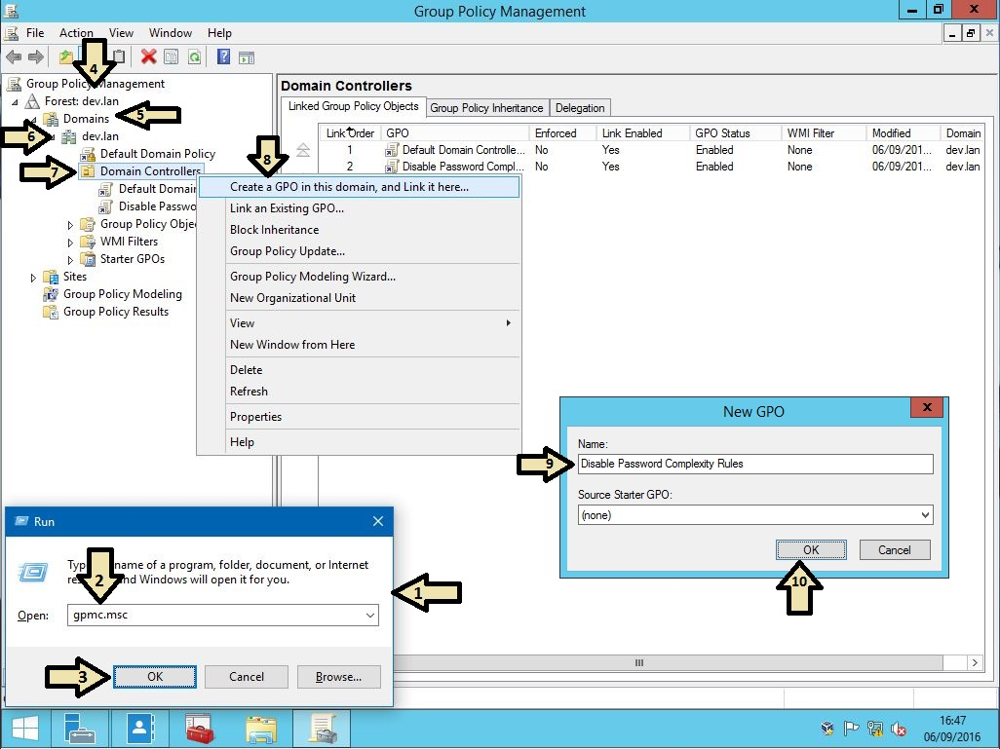
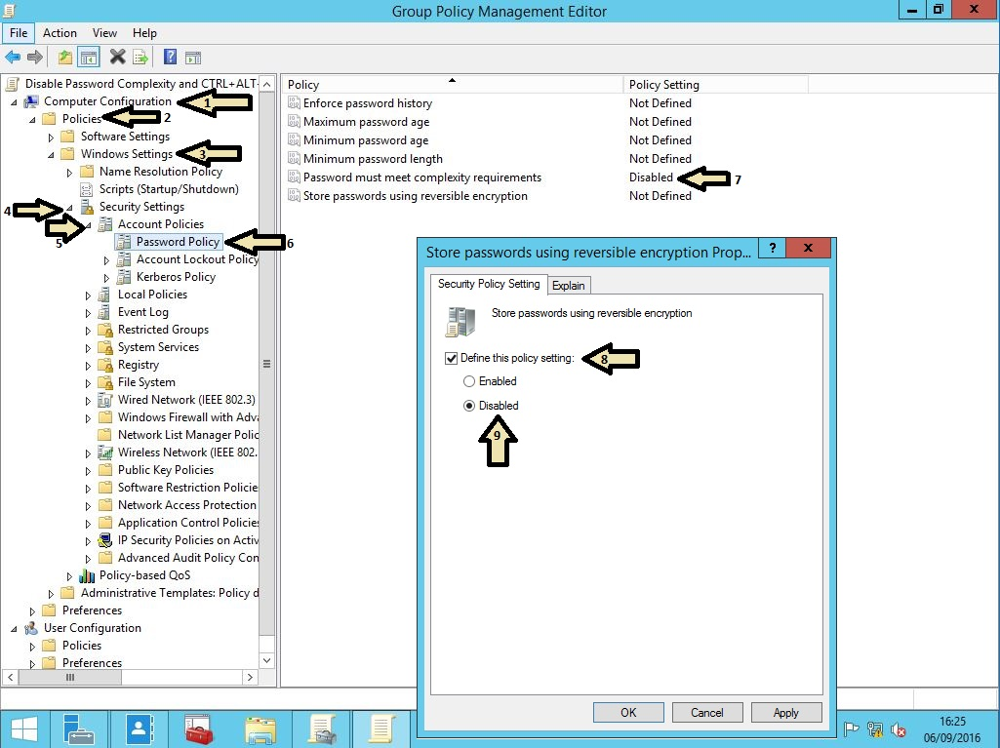
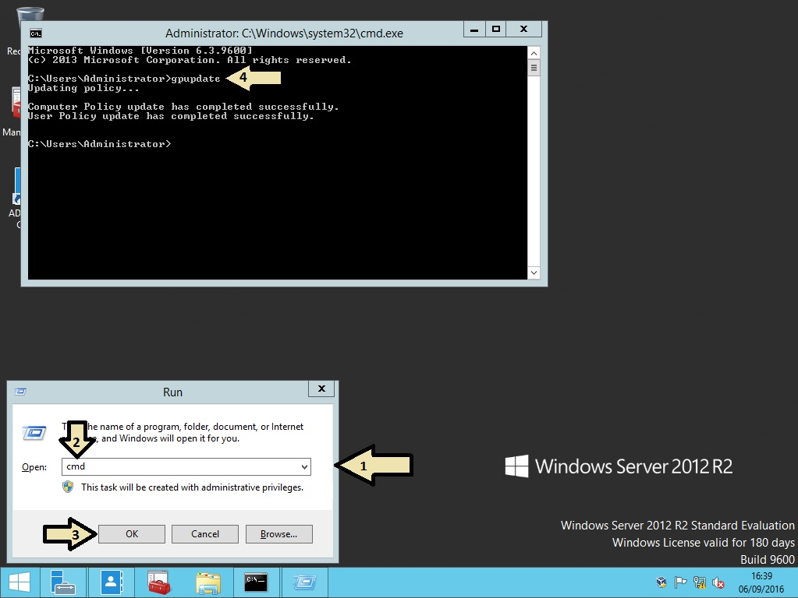

+++
draft = false
date = 2018-01-04T12:34:52+00:00
title = "Disable the password complexity for Active Directory on a Domain Controller"
description = "I recently ran into an issue where I couldn't change the password of an account in AD from one of the Domain Controllers. I realised it's because it has a different Group Policy than other computers.  Run > gpmc.msc"
featuredImage = "header.jpg"
slug = "disable-the-password-complexity-for-active-directory-on-a-domain-controller"
authors = ["tigattack"]
tags = []
categories = ["technology"]
series = []
+++

I recently ran into an issue where I couldn't change the password of an account in AD from one of the Domain Controllers. I realised it's because it has a different Group Policy than other computers.

1. Open Group Policy Management (`gpmc.msc`).
2. Expand your forest, expand the Domains container, expand your domain, and then right click on the Domain Controllers container.
3. Pick *"Create a GPO in this domain, and Link it here..."*.
4. Pick a name for your GPO (e.g. *"Disable Password Complexity Rules"*)
and click OK.
<figure>
  
  <figcaption><em>Note from future self: Why did you make these images like this.</em></figcaption>
</figure>

5. Expand the Domain Controllers container, right click on your new policy, and pick *"Edit..."*.
6. Navigate through Computer Configuration > Policies > Windows Settings > Security Settings > Account Policies.
7. Open the policy named *"Password must meet complexity requirements"* and set it to Disabled.

The policy is now set, and all you need to do is run `gpupdate`, so open `cmd` and do that. It can take a few seconds.

**Once gpupdate has completed, you're all set.**

---

I always welcome feedback on my posts, please [contact me](https://blog.tiga.tech/about-contact) if you have any. I'm also happy to answer any related questions if I know the answer.
