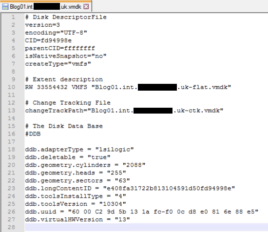
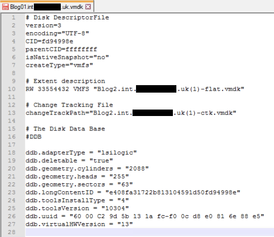

+++ 
draft = true
date = 2019-12-05T00:00:00+01:00
title = "Fix a VMDK after renaming with 'mv'"
description = ""
slug = "fix-a-vmdk-after-renaming-with-mv"
authors = ["tigattack"]
tags = ["vmware", "vmdk", "esxi"]
categories = ["technology"]
series = []
+++

Open VMDK in Notepad

Fix pointers

