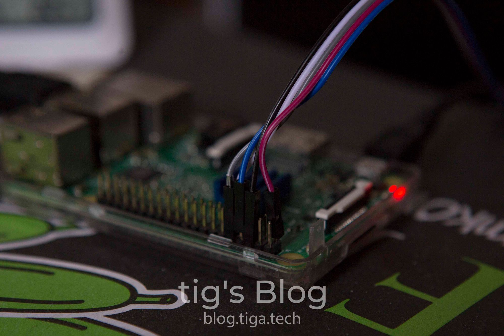
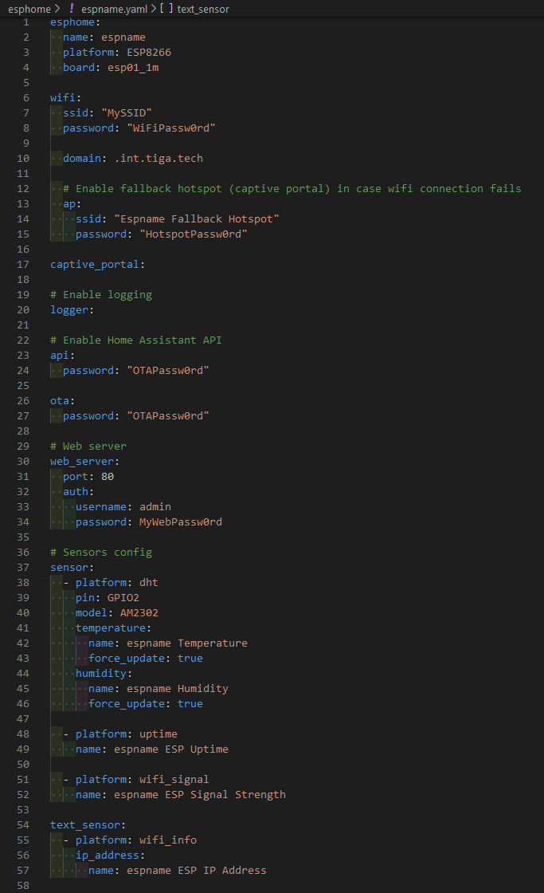
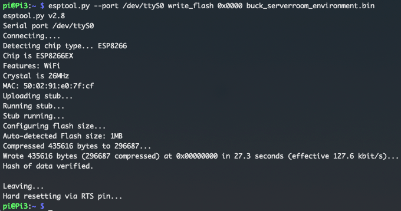
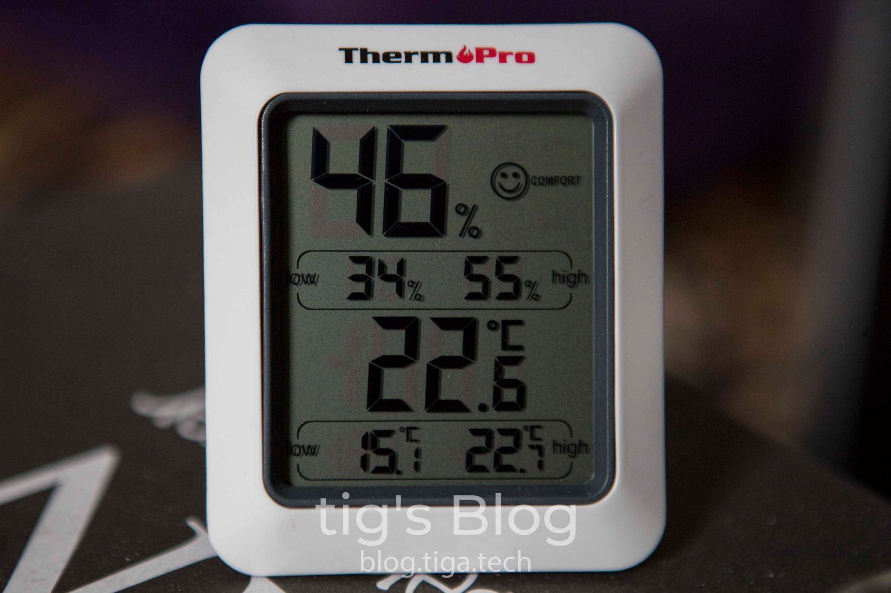

+++
draft = false
date = 2020-05-21T17:15:25+01:00
title = "Flashing ESPHome Firmware to ESP-01S"
description = "In this post I'll run through how to create and flash ESPHome firmware for an ESP8266-based temperature sensor."
featuredImage = "header.jpg"
slug = "flashing-esphome-firmware-to-esp-01s"
aliases = ["/flashing-esphome-firmware-to-esp-01s"]
authors = ["tigattack"]
tags = ["home assistant", "hass", "esp", "esphome"]
categories = ["technology"]
series = []
+++

I recently came across a [listing on AliExpress](https://www.aliexpress.com/item/32956461021.html) for an ESP-01S (an ESP8266-based chip) and AM2302 combination. You'll want the option named "AM2302 ESP-01S". This is also available [here, on Amazon UK](https://amzn.to/3hcKhef), for a little more, if you'd like to get it faster.  
At $4.38/ea (~£3.60) plus shipping I couldn't say no, so I decided to buy a bunch of them to monitor the temperature and humidity in various locations around the house.  
I also bought one of these [USB dupont cables](https://www.aliexpress.com/item/1000007049130.html) from AliExpress for each unit; since I have a bunch of old USB power blocks lying around, this was the easiest way for me to power them. You can get an alternative [here, on Amazon UK](https://amzn.to/2WA77mF). It's actually a serial adaptor but since we only need to provide power, it will work.

In this post I'll run through how to create an ESPHome configuration for an ESP8266-based temperature sensor and how to flash the firmware.

If you already have your firmware and just want to know how to flash it,
you can skip down to the ["flashing the firmware"](#flashing-the-firmware)
section.

---



# Prerequisites

* Home Assistant (HASS) with the [ESPHome plugin installed](https://esphome.io/guides/getting_started_hassio.html).
* A Raspberry Pi running Linux. Instructions for installing Raspbian on a Pi can be found [here](https://www.raspberrypi.org/documentation/installation/installing-images/README.md).
* 5 jumper wires.



# ESPHome configuration

1. Navigate to the ESPHome plugin in HASS.
2. Click the + button.
3. Run through the configuration steps as follows:
    * **Name:** Anything you wish. We'll call it "espName" from now on.
    * **Device Type:** Generic ESP8266.
    * **WiFi and Over-The-Air Updates:** WiFi is self-explanatory so I won't explain that. The access password is the password which will be used by ESPHome to flash updates over the air to the ESP and authenticate with the ESPHome API on the ESP.
4. This step will depend on how you modify your HASS configuration; I use the VS Code plugin.  
    Open the following file in HASS: `/config/esphome/espName.yaml`  
    *Unless you're running your own router and/or DNS server, you can skip steps 5-6 and proceed to step 7.*
5. In the `wifi` section of the file you just opened, add the following: `domain: .<your-internal-domain-name>`. This is what mine looks:

<pre class="language-yaml" data-line="10">
<code>esphome:
  name: espName
  platform: ESP8266
  board: esp01_1m

wifi:
  ssid: "MySSID"
  password: "WiFiPassw0rd"

  domain: .int.tiga.tech

  # Enable fallback hotspot (captive portal) in case wifi connection fails
  ap:
    ssid: "Espname Fallback Hotspot"
    password: "HotspotPassw0rd"

captive_portal:

# Enable logging
logger:

# Enable Home Assistant API
api:
  password: "OTAPassw0rd"

ota:
  password: "OTAPassw0rd"
</code></pre>


1. Now open: `/config/esphome/.esphome/espName.yaml.json`.  
    Change the address from `espName.local` to `espName.<your-internal-domain-name>`.  
    This is what mine looks like, see line 8:

<pre class="language-json" data-line="10">
<code>{
  "storage_version": 1,
  "name": "espName",
  "comment": null,
  "esphome_version": "1.14.3",
  "src_version": 1,
  "arduino_version": null,
  "address": "espName.int.tiga.tech",
  "esp_platform": "ESP8266",
  "board": "esp01_1m",
  "build_path": null,
  "firmware_bin_path": null,
  "loaded_integrations": []
}</code></pre>

Please **do not** copy this since your ESPHome version may be different if you're following this in the future, and copying this could lead to issues.

1. In `/config/esphome/espName.yaml` you need to add the following:

```yml
# Web server
web_server:
  port: 80
  auth:
    username: admin
    password: MyWebPassw0rd

# Sensors config
sensor:
  - platform: dht
    pin: GPIO2
    model: AM2302
    temperature:
      name: espName Temperature
      force_update: true
    humidity:
      name: espName Humidity
      force_update: true

  - platform: uptime
    name: espName ESP Uptime

  - platform: wifi_signal
    name: espName ESP Signal Strength

text_sensor:
  - platform: wifi_info
    ip_address:
      name: espName ESP IP Address
```





# Compiling the firmware

1. Navigate to the ESPHome plugin in HASS.
2. Click the 3-dots menu button and "Compile".
3. Once compiled, click the "Download binary" button in the bottom right.
4. Save the binary to your machine.

# Flashing the firmware

## Preparing the ESP

Connect 5 jumper wires between the Raspberry Pi's GPIO and the ESP's pins, as per the diagram below.  
*Make sure that you connect the 3v3&lt;-&gt;VCC wire last of all.*



## Preparing the Pi

1. SSH to your Pi or connect a keyboard and display.
2. In the terminal run: `sudo raspi-config`
3. Select "5 Interfacing Options", "P6 Serial", "No", "Yes", and finally "Finish".
4. Restart the Pi with `sudo reboot`
5. In the terminal run: `pip install esptool`. This will install [esptool](https://github.com/espressif/esptool), a Python utility to interact with ESP8366 & ESP32 chips.  
    If the result of this command is *"pip: command not found"*, run `sudo apt install python-pip` and try again.
6. Test esptool by running: `esptool.py --port /dev/ttyS0 flash_id`  
    If successful, this will return some information about your ESP chip. You should now pull the wire connected to GPIO1 (3v3 or VCC)
    on your Pi to restart the ESP.  
    If unsuccessful, there is a communication issue with your ESP. Start by checking the wiring.

## Copying and flashing

1. Copy the firmware file to the Pi. I used [scp](https://linux.die.net/man/1/scp) to do this:
<pre
  class="language-yaml"
  class="no-line-numbers">
<code>scp ~/Downloads/espName.bin pi@raspberrypi:/home/pi/
</code></pre>

1. SSH to your Pi or connect a keyboard and display.
2. In the terminal run:
    `esptool.py --port /dev/ttyS0 write_flash 0x0000 ~/espName.bin`  
    If successful, you'll see a similar output to this:  
    

As you can see, the MAC address of the chip has been printed as part of the ouput. You can use this to create a DHCP reservation for the ESP, if you so wish.

You may now connect the ESP to the AM2302 sensor and power it up.  
If you're using the [USB dupont cables](https://www.aliexpress.com/item/1000007049130.html) I mentioned at the beginning, red is VCC and black is GND. The pins for power are labeled as such on the AM2302.

# Home Assistant configuration

Once you've connected the ESP to the sensor and powered it up, you should see it come online in the ESPHome interface in HASS. If not, you may have a communication issue. Double check the address in HASS file `/config/esphome/.esphome/espName.yaml.json` and make sure you can resolve it.

HASS should now discover the device automatically and create a notification to alert you of this. It will also be visible in Configuration-&gt;Integrations.  
Click the notification or navigate to Integrations, then click "Configure" on the discovered entity.

If the entity is not discovered, go to Integrations, hhit the + in the bottom right, select ESPHome, then enter the IP or DNS address of your ESP.

You will now have 5 new entities:

* espName Temperature
* espName Humidity
* espName ESP IP Address
* espName ESP Signal Strength
* espName ESP Uptime

# Calibrating the sensor

You may need to calibrate your temperature sensors. I used a room temperature & humidity sensor to find the delta between the ESP reported values and real values. Once you've found your deltas, record them to use in the following steps.



1. Open the following file in HASS: `/config/esphome/espName.yaml`
2. Replace lines 41-46 with the following, inputting your own offsets.

<pre class="language-yml">
<code>    temperature:
      name: espName Temperature
      force_update: true
      filters:
        - offset: -7.4
    humidity:
      name: espName Humidity
      force_update: true
      filters:
        - offset: 6
</code></pre>

Note that these values are my own and may not be correct for you. The temperature reported by my ESP was 7.4 degrees higher than actual, and the reported humidity was 6% lower than actual.

# Invalid Readings Error

Occasionally you may see an issue where HASS will shoow `NaN` as the value for temperature and humidity. If you check the device's log output in ESPHome, it will look something like this:

```log
[08:39:11][W][dht:126]: Requesting data from DHT failed!
[08:39:11][W][dht:060]: Invalid readings! Please check your wiring (pull-up resistor, pin number).
```

There are a few possible solutions to this, but it depends on the root cause of the issue.

## Updates and self-reset


This issue seems to have been fixed in ESPHome 1.15.0 - 
[esphome/esphome#1185](https://github.com/esphome/esphome/pull/1185)  
I'm leaving this here since some people still see this issue on occasion.


One root cause of the problem detailed above is an issue with the self-reset functionality which is triggered after an OTA update or network connection failure.

There is no automated solution to this when seen after an OTA unfortunately; you need to manually power-cycle the ESP. Just unplug it for a few seconds.

The self-reset issue has also been seen with what is, at the time of writing, the latest UniFi firmware. In these cases a static IP has proven to help with reliability.

The issue is triggered by the ESP not picking up an IP from your DHCP server fast enough, so it self-resets a few times and eventually gets an IP, triggering the issue with self-resets which I described above.

To stop this happening you can try [giving your ESP a static IP](https://esphome.io/components/wifi.html#manual-ips).

## Connectivity

Sometimes the ESP will disconnect or reconnect WiFi after a while.

There's a few things which can help this, all of which are documented in [ESPHome's FAQ section](https://esphome.io/guides/faq.html#my-node-keeps-reconnecting-randomly).

---

I always welcome feedback on my posts, please [contact me](/contact) if you have any. I'm also happy to answer any related questions if I know the answer.
