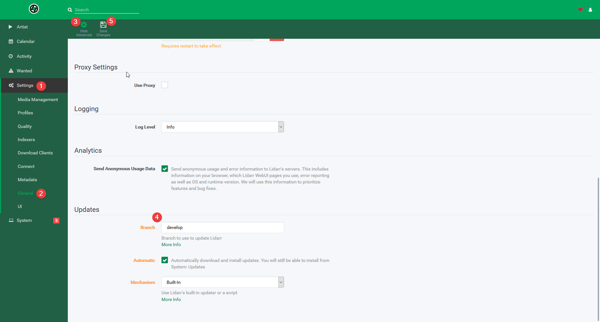

+++
draft = false
date = 2018-01-08T15:05:06+00:00
title = "How to install Lidarr on Ubuntu"
description = "Lidarr is still in alpha, but you can install it on Ubuntu with some ease.  Credit for this goes to my friend Dan."
slug = "how-to-install-lidarr-on-ubuntu"
aliases = ["/how-to-install-lidarr-on-ubuntu"]
authors = ["tigattack"]
tags = []
categories = ["technology"]
series = []
+++


**Update:** As of 4th June 2022, Lidarr has a stable release available. It's also [highly documented](https://wiki.servarr.com/lidarr) now, rendering this post pretty much entirely redundant.  
I suggest you follow [their instructions](https://wiki.servarr.com/lidarr/installation) for installing on Ubuntu or, even better, running in Docker.



[Lidarr](https://github.com/lidarr/Lidarr) is still in alpha, but you can install it on Ubuntu with some ease.

Credit for much of this process goes to my friend [Dan](https://github.com/dantho281/).

---

1. Add the mono repo and install mono. This is necessary since the version provided with Ubuntu is out of date and will not work with Lidarr.

```shell
sudo apt-key adv --keyserver hkp://keyserver.ubuntu.com:80 --recv-keys 3FA7E0328081BFF6A14DA29AA6A19B38D3D831EF
echo "deb http://download.mono-project.com/repo/ubuntu xenial main" | sudo tee /etc/apt/sources.list.d/mono-official.list
sudo apt update
sudo apt install mono-devel
```

2. Download the latest Linux build from [Lidarr's GitHub](https://github.com/lidarr/Lidarr/releases).

```shell
wget https://github.com/...
```

Fill in the URL with the link to the latest build.

3. Choose a directory to extract Lidarr to, in my case this is `/opt/`, and extract it like so:

```shell
sudo tar -xzvf <FILENAME> --directory /opt/
```

Replace `<FILENAME>` with the Lidarr tarball filename.  
In my case this was `Lidarr.develop.0.3.1.471.linux.tar.gz`.

4. Create a user called "lidarr":

```shell
sudo tar -xzvf <FILENAME> --directory /opt/
```

The `-m` argument tells it to not create a home directory for the user.

5. Give the Lidarr user ownership of the Lidarr directory:

```shell
sudo chown -R lidarr:lidarr /opt/Lidarr
```

6. Create a systemd script like so:

```shell
sudo nano /etc/systemd/system/lidarr.service
```

And paste in the following

```ini
[Unit]
Description=Lidarr Daemon
After=syslog.target network.target

[Service]
User=lidarr
Group=lidarr
Type=simple
ExecStart=/usr/bin/mono /opt/Lidarr/Lidarr.exe -nobrowser
TimeoutStopSec=20
KillMode=process
Restart=on-failure

[Install]
WantedBy=multi-user.target
```

7. Enable auto-start for the service, and then start it

```shell
sudo systemctl enable lidarr.service
sudo systemctl start lidarr
```

Lidarr will now be available at `http://<IP>:8686`

8. Set the update branch:
    1. Navigate to your Lidarr web interface and go to Settings > General
    2. Click "Show Advanced"
    3. Go to the bottom of the page
    4. Ensure the update branch is set to "develop"
    5. Save changes.



This means that you'll get the closest to stable that's available, other builds have been known to break the DB. This is usually default but it's important to check.

Success!

---

I always welcome feedback on my posts, please [contact me](/contact) if you have any. I'm also happy to answer any related questions if I know the answer.
