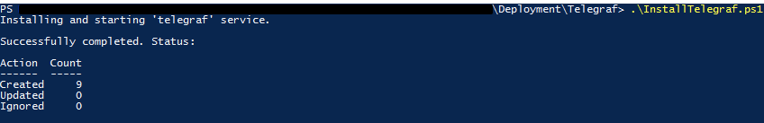
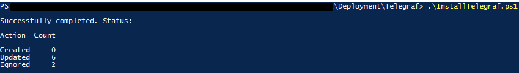

+++
draft = false
date = 2021-05-11T02:33:55+01:00
title = "Dynamically Deploy Telegraf and Windows Monitoring Configurations with PowerShell"
description = "This is a Telegraf deployment script for Windows Server environments."
slug = "install-telegraf-posh"
aliases = ["/install-telegraf-posh"]
authors = ["tigattack"]
tags = ["powershell", "telegraf", "monitoring", "metrics"]
categories = ["technology"]
series = []
+++

I recently made [this script](https://github.com/tigattack/Install-Telegraf-PoSH/blob/main/InstallTelegraf.ps1) to deploy the [Telegraf](https://www.influxdata.com/time-series-platform/telegraf/) metrics agent to Windows systems.

This is primarily designed for Windows Server but can also be pushed to workstations.


# Overview

This is a Telegraf deployment script for Windows Server\* environments.

By default, the script will install a base configuration which includes:

* Telegraf agent as system service *([configurable](#parameters))*.
* Your pre-configured [**output plugin**](https://github.com/tigattack/Install-Telegraf-PoSH/blob/main/telegraf.conf).
* A comprehensive [**system metrics input plugin**](https://github.com/tigattack/Install-Telegraf-PoSH/blob/main/telegraf-system-metrics.conf) configuration.

It will then scan the system to determine candidacy for the following additional input plugins:

| Role                             | Configuration Applied                                                                                    |
|----------------------------------|-------------------------------------|
| Active Directory Domain Services | [telegraf-adds.conf](https://github.com/tigattack/Install-Telegraf-PoSH/blob/main/telegraf-adds.conf) ** |
| DFS Namespaces                   | [telegraf-dfsn.conf](https://github.com/tigattack/Install-Telegraf-PoSH/blob/main/telegraf-dfsn.conf)    |
| DFS Replication                  | [telegraf-dfsr.conf](https://github.com/tigattack/Install-Telegraf-PoSH/blob/main/telegraf-dfsr.conf)    |
| DNS Server                       | [telegraf-dns.conf](https://github.com/tigattack/Install-Telegraf-PoSH/blob/main/telegraf-dns.conf)      |

I am happy to add further configurations upon request; please raise an issue or pull request, ideally with an example Telegraf configuration.

**\*** While this script is primarily designed for Windows Server, it will still work for Windows clients, the only difference being the additional configurations in the table above will never be installed (i.e. only the agent, output plugin, and system metrics input plugin).

**\*\*** All of the above configurations are typically (but not always) applied to domain controllers since they commonly have all of the mentioned roles installed.

**Suggested script deployment method:** Group Policy computer start-up script.  
It is flexible in this regard though, the only requirement being that it is run on the device itself.

# Requirements

* PowerShell 5.1 or higher.
* Administrator privileges.
* A network share with the following files in a flat structure:
    * `telegraf.exe`
    * `telegraf.exe.sha256sum` \*
    * `telegraf.conf`
    * `telegraf-adds.conf`
    * `telegraf-dfsn.conf`
    * `telegraf-dfsr.conf`
    * `telegraf-dns.conf`
    * `telegraf-system-metrics.conf`

**\*** This file must contain **only** the SHA256 sum of `telegraf.exe`.

# Setup

1. Download all the files in [the repository](https://github.com/tigattack/Install-Telegraf-PoSH) to your desired source location (i.e. a network path). This can be done by running the commands below in PowerShell\*.

```powershell
cd \\path\to\share # Make sure you change this
[Net.ServicePointManager]::SecurityProtocol = [Net.SecurityProtocolType]::Tls12
Invoke-WebRequest "https://github.com/tigattack/Install-Telegraf-PoSH/archive/refs/heads/main.zip" -OutFile "$env:TEMP\Install-Telegraf-PoSH.zip"
Expand-Archive -Path "$env:TEMP\Install-Telegraf-PoSH.zip" -DestinationPath "$env:TEMP\"
Remove-Item "$env:TEMP\Install-Telegraf-PoSH.zip"
Remove-Item "$env:TEMP\Install-Telegraf-PoSH-main\.github" -Recurse
Move-Item "$env:TEMP\Install-Telegraf-PoSH-main\" ".\Install-Telegraf"
```

2. Download the latest Telegraf release for Windows from [Telegraf's GitHub releases](https://github.com/influxdata/telegraf/releases).
3. Extract the EXE from the downloaded ZIP and move it to the source location.
4. Rename the EXE to `telegraf.exe`.
5. Open PowerShell, cd to the source directory (e.g. `cd \\path\to\share`) ,and run the following command:

```powershell
(Get-FileHash -Algorithm SHA256 ".\telegraf.exe").Hash | Out-File ".\telegraf.exe.sha256sum"
```

6. Configure your output plugin and any other Telegraf agent settings in `telegraf.conf`.

Ready to go!

**\*** This little script is entirely safe. It instructs PowerShell to use TLS1.2 (allowing it to download from a secure (HTTPS) URL), downloads a ZIP of this repository to a temporary location, extracts the ZIP, removes the ZIP, moves this project into your destination directory, then removes the extracted directory.  
However, please also feel free to perform a manual download of all the files in [the repository](https://github.com/tigattack/Install-Telegraf-PoSH) (except
`README.md` and `.github`).

# Usage

## Example

### Screenshots





### Commands

Standalone:

```powershell
InstallTelegraf.ps1 -Source '\\path\to\share' `
    -Destination 'C:\custom\path' `
    -ServiceName 'my-telegraf' `
    -ServiceDisplayName 'My Telegraf' `
    -LogPath 'C:\Windows\TEMP\InstallTelegraf.log'
```

Standalone dry run:

```powershell
InstallTelegraf.ps1 -Source '\\path\to\share' `
    -Destination 'C:\custom\path' `
    -ServiceName 'my-telegraf' `
    -ServiceDisplayName 'My Telegraf' `
    -LogPath 'C:\Windows\TEMP\InstallTelegraf.log' `
    -WhatIf
```

Automated Deployment:

```powershell
PowerShell.exe -WindowStyle Hidden -File '\\path\to\InstallTelegraf.ps1' `
    -Source '\\path\to\share' `
    -Destination 'C:\custom\path' `
    -ServiceName 'my-telegraf' `
    -ServiceDisplayName 'My Telegraf' `
    -LogPath 'C:\Windows\TEMP\InstallTelegraf.log'
```

## Parameters

| Parameter          | Type   | Description                                                                                                                |
|--------------------|--------|-------------------------------------------------------|
| Source             | String | Path to network share containing Telegraf source (agent, configurations, etc.). Defaults to the script's parent directory. |
| Destination        | String | Path to Telegraf destination directory. Defaults to 'C:\Program Files\Telegraf'.                                           |
| InstallService     | Switch | Defaults to true but can be used to disable the installation of the Telegraf service (i.e. `-InstallService:$false`).        |
| ServiceName        | String | Telegraf service name. Defaults to 'telegraf'.                                                                             |
| ServiceDisplayName | String | Telegraf service display name. Defaults to 'Telegraf'.                                                                     |
| LogPath            | String | Path to log file. Defaults to 'C:\InstallTelegraf.log'.                                                                    |
| WhatIf             | Switch | Performs a dry run.                                                                                                        |
| Confirm            | Switch | Prompts user for confirmation before taking action.                                                                        |
| Verbose            | Switch | Enables verbose output.                                                                                                    |

---

I always welcome feedback on my posts, please [contact me](/contact) if you have any. I'm also happy to answer any related questions if I know the answer.
