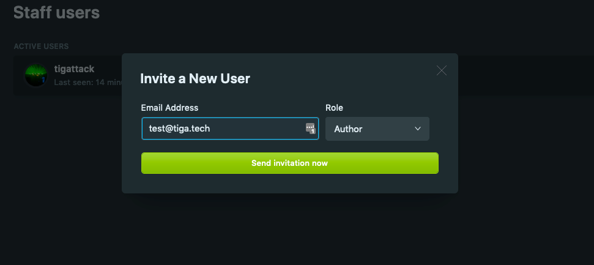
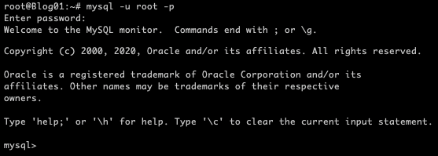
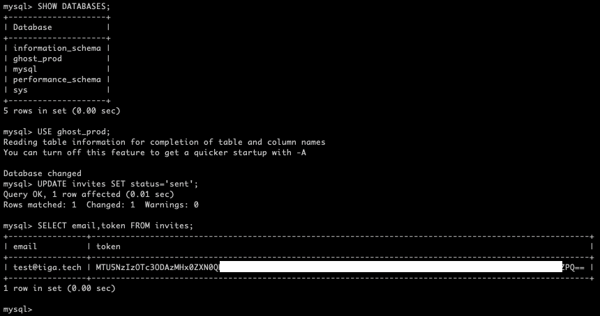
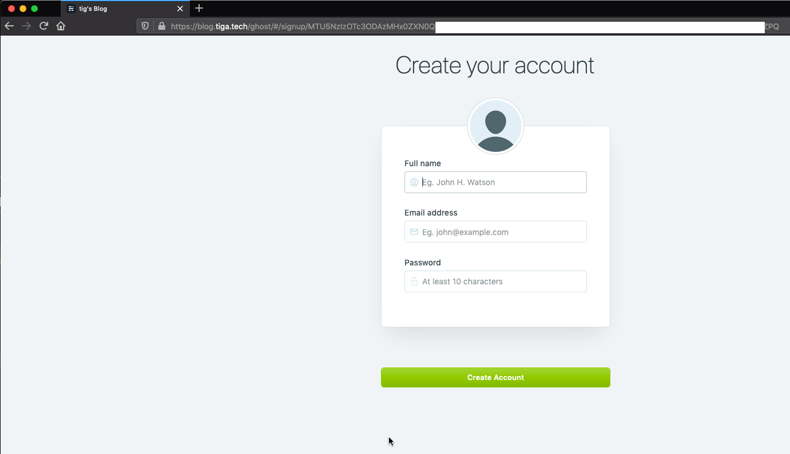

+++
draft = false
date = 2019-10-29T11:31:25+00:00
title = "Invite users to a Ghost blog without sending an email"
description = ""
featuredImage = "header.png"
slug = "invite-users-to-a-ghost-blog-without-sending-an-email"
authors = ["tigattack"]
tags = []
categories = ["technology"]
series = []
+++

The Ghost platform makes it all but impossible to add new users if you don't have a mail server configured.  
In this post, I will show you how to work around this and add new users without needing to send an email.

---



# Requirements

* `SELECT` and `UPDATE` permissions on the database backing Ghost.  
  If you set Ghost up yourself, you will have this.

# Invite the User

1. Log into your Ghost blog.
2. Go to the "Staff" section.
3. Click "Invite People".
4. Insert a dummy email and the role you'd like the user to have, then click "Send invitation now".  
      
    Note: You'll probably see an error after you've submitted the invitation. You can safely ignore this.

# Get the Invitation

1. Connect to a shell on the server hosting your Ghost site.
2. Run the following command to login to mysql: `mysql -u <user> -p`  

3. Ghost's database is most likely named `ghost_prod`, but run the following command to make sure: `SHOW DATABASES;`
4. Run the following command to tell MySQL that you're operating on the Ghost database: `USE ghost_prod;`. Replace `ghost_prod` with the name of your Ghost database if it differs.
5. You need to tell Ghost that the invitation has been sent, otherwise the invitation will remain invalid: `UPDATE invites SET status='sent';`
6. Now run `SELECT email,token FROM invites;`. The invitation token is the important part of the output of this command. You want all of it **except** for the `=` (or
    `==` in some cases) at the end.  
    
7. Replacing `<token>` with the token from the output of the last command and `<your-blog-address>` with your site's address (e.g. blog.tiga.tech), send the following URL to the user:  
  `https://<your-site-address>/ghost/#/signup/<token>`

Done!

When the user visits this URL, they will see the sign-up page:

---

I always welcome feedback on my posts, please [contact me](/contact) if you have any. I'm also happy to answer any related questions if I know the answer.
