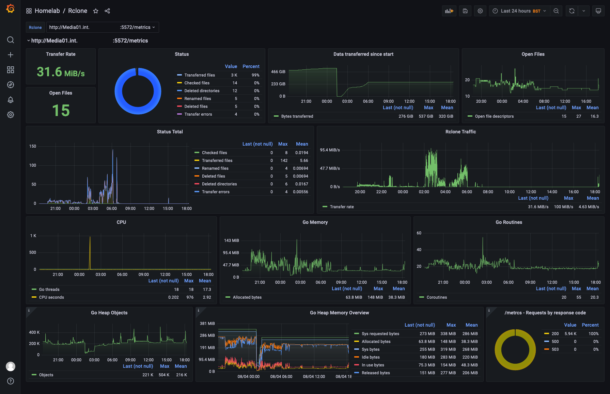
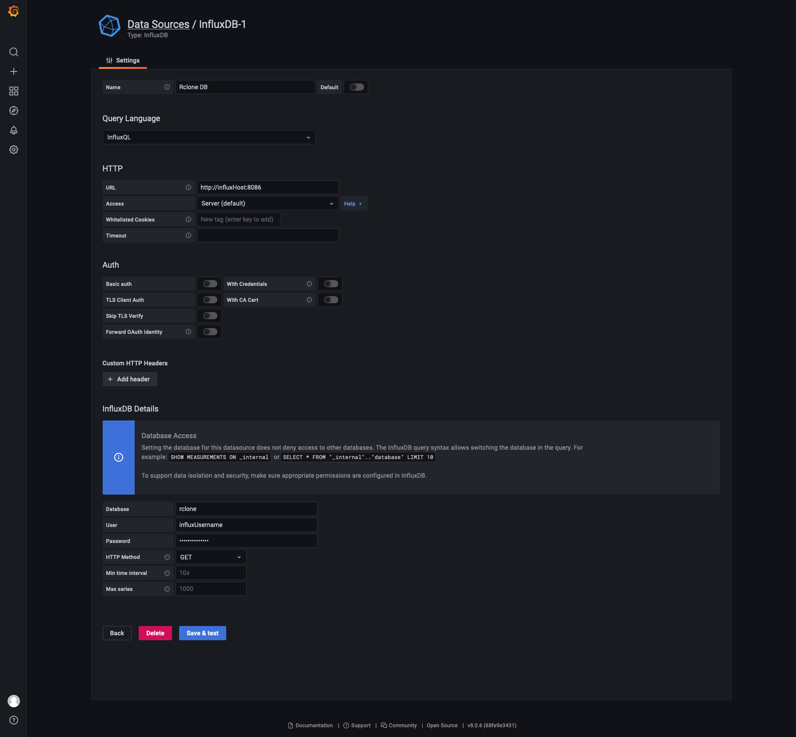

+++ 
draft = true
date = 2021-08-29T00:00:00+01:00
title = "Monitoring Rclone with Grafana and InfluxDB"
description = "In this post, we'll look at monitoring some important metrics from Rclone using Grafana, InfluxDB, and Telegraf."
slug = "rclone-grafana"
authors = ["tigattack"]
tags = ["monitoring", "grafana", "rclone"]
categories = ["technology"]
series = []
+++

In this post, we'll look at monitoring some important metrics from Rclone using Grafana, InfluxDB, and Telegraf.

I started looking into this after I followed a blog post that a good friend of mine recently published: [MonsterMuffin - Unlimited Plex Storage via Google Drive And Rclone](https://blog.muffn.io/unlimited-plex-storage-via-google-drive-and-rclone/).

Having a clear point of observation for these metrics will aid in identifying and troubleshooting issues, track data usage over any given times pan, identify peak usage periods, and so on.

Also, data is cool.

---



Before we jump in, let's talk a little about Rclone's [`rc` mode](https://rclone.org/rc/), which we'll be using for this.

Rclone exposes some handy metrics through its `rc` mode.
In short, there are two ways of doing this: 

[1](#option-1add-rclone-rc-to-your-existing-setup): Add the relevant `rc` flags to your existing service or script.

[2](#option-2run-rclone-rcd-as-a-daemon): Run Rclone `rcd` (rc daemon) in a service and configure your mounts etc. using ExecStartPost declarations. You could also a script or some other method, but ExecStartPost is easy and functional.

Option 1 is very easy to get started with given Rclone's solid documentation for `rc`. You can basically be ready to go with the few command flags I'll cover in the first step.

However, the downside to this option is that for each Rclone command you run, whether this is in a service, in a script, or manually, you must specify a port that is not bound by an existing Rclone process, or any process for that matter.  

This may sound obvious, but the result is that you will have to scrape multiple endpoints if you wish to gather metrics for more than one Rclone process. I'll cover this when we configure Telegraf later, should you wish to use this option.  

While this may be a significant inconvenience for some of you, if you only have a single Rclone daemon, scheduled task, or other, this is a perfectly valid option and the one you should use.

Option 2 is fantastic for unifying your metrics since all of your Rclone commands will be executed through a single process, this instance of `rcd`. Resultingly, all of your metrics will be available at a single endpoint.

You may have already noticed the downside; all of your Rclone commands must be executed through a single `rcd` instance for this to work.  
In other words, you will need to run all of your Rclone commands, whether as a daemon, in a script, or manually, using `rclone rc`.

Having said that, you are still free to run traditional Rclone commands and you will suffer no issues; you will simply see no metrics from these commands at the designated metrics endpoint.

Whether this works for you will depend on your use case. Sometimes, `rc` commands are not particularly user-friendly. They're fine for scripts and services, but it makes one-off commands quite difficult unless you're well experienced in its usage.

As much as I like option 2, personally I use the first since some of the ways I'm using Rclone don't translate very well to `rc` commands.

---

# Configuring Rclone

I'm going to assume you are running Rclone as a daemon since that makes this a lot more straightforward.  
If you're not, there are many tutorials on how to do this, or you could just bastardise [MonsterMuffin's `gmedia.service` example](https://github.com/MonsterMuffin/rclone-gmedia/blob/main/services/gmedia.service).

You will need to edit your Rclone service file to add the following flags.

The flags you will need are:
* Enable [Rclone remote control](https://rclone.org/rc/): `--rc`
* Enable the Rclone metrics endpoint: [`--rc-enable-metrics`](https://rclone.org/rc/#rc-enable-metrics)
* Bind to all live interfaces on port 5572: [`--rc-addr=0.0.0.0:5572`](https://rclone.org/rc/#rc-addr-ip)

I highly recommend configuration authentication. Destructive actions are not possible without authentication, but there is sizable scope for information gathering and inconvenient actions. You can see each support rc command and whether it requires authentication [here](https://rclone.org/rc/#supported-commands).

You can use either of the following flags to enable HTTP authentication:
* Plaintext: `--rc-user=<username> --rc-pass=<password>`
* htpasswd file: `--rc-htpasswd=/path/to/htpasswd`

As I mentioned above, there are two routes you can take when configuring this; I've covered both below.

## Option 1 - Add Rclone `rc` to your existing setup

The first and simplest option is to simply add the flags above to your mount (or other) command.

Example command:
<pre class="command-line language-bash" data-prompt="$">
<code>rclone mount --rc --rc-addr=0.0.0.0:5572 --rc-enable-metrics \
    --rc-user='username' --rc-password='password' \
    &lt;your-remote&gt;: /your/mount/point</code>
</pre>

If you have multiple mounts, you can add these flags to all of them, but you will need to change the port since multiple Rclone processes cannot bind to the same port.

## Option 2 - Run Rclone `rcd` as a daemon

For this option, we'll look at running `rcd` as a daemon.

You may remember what I said earlier about `rc` commands sometimes not being particularly user-friendly, how they're fine for scripts and services, but can make one-off commands quite difficult unless you're experienced with it.  Well, this is where you may see that.

In the second service definition you will notice that the global options are specified differently when using `rc`. Global options are exactly the same as Rclone's global flags in functionality, but all key:value pairs must be specified as JSON, and both the key and value names differ slightly in some cases.

In some cases this can get quite complex due to differences which are occasionally difficult to work with. One such case I found is time values, which can typically be specified in shorthand (e.g. `1h`) must often be specified in nanoseconds when using `rc`, as seen in the example below.  
Note: I later found this to not always be the case, but if anything this inconsistency worsens the matter.

Some examples:
* Traditional flags become a JSON object:
    `--user-agent tig --timeout 1h` would become `--json {"main": {"UserAgent": "tig"}, "Timeout": 3600000000000}`.

* An example of some of the oddities:
    `--cache-mode full` becomes `{"vfs": {"CacheMode": 3}}`.

You can see all available options like so:

<pre class="command-line language-bash" data-prompt="$">
<code>rclone rc options/get --rc-user='username' --rc-pass='password'</code>
</pre>

In the standalone service definition below, we want to focus on 2 things:

1. `ExecStart` - This command launches Rclone's `rcd` using the specified configuration flags.

3. `ExecStop` - This command runs when you stop the service and will unmount all remotes.

rclone-rcd.service standalone

<pre class="language-ini line-numbers">
<code>[Unit]
Description=Rclone rcd and mount Service
After=network-online.target
 
[Service]
Type=notify
ExecStart=/usr/bin/rclone rcd \
	--rc-addr=0.0.0.0:5572 \
	--rc-enable-metrics \
	--rc-user='username' \
    --rc-pass='password' \
	--config=/path/to/your/rclone.conf \
	--log-level INFO \
	--log-file=/path/to/your/rcd.log \
ExecStop=/usr/bin/rclone rc --user 'username' --pass 'password' mount/unmountall
Restart=on-failure
RestartSec=5
StartLimitInterval=60s
StartLimitBurst=3
TimeoutStartSec=150
 
[Install]
WantedBy=multi-user.target</code>
</pre>

In this second service definition, I've added an `ExecStartPost` to mount a remote.
`ExecStartPost` commands run after the ExecStart command has succeeded.  This method is a good way of launching `rcd` and almost instantly mounting your remote.

The first `ExecStartPost` will set various global Rclone options that cannot be defined with the `rc mount/mount` command.  
The second `ExecStartPost` mounts your remote.

rclone-rcd.service with mount

<pre class="language-ini line-numbers">
<code>[Unit]
Description=Rclone rcd and mount Service
After=network-online.target
 
[Service]
Type=notify
ExecStart=/usr/bin/rclone rcd \
	--rc-addr=0.0.0.0:5572 \
	--rc-enable-metrics \
	--rc-user='username' \
    --rc-pass='password' \
	--config=/path/to/your/rclone.conf \
	--cache-dir=&lt;optional-cache-dir&gt; \
	--log-level INFO \
	--log-file=/path/to/your/rcd.log \
 
&#35; Set global opts
ExecStartPost=/usr/bin/rclone rc options/set \
	--rc-user='username' --rc=pass='password' \
	--json '{"main": {"UserAgent": "someuseragenthere", "Timeout": 3600000000000}, "mount": {"AllowOther": true}, "vfs": {"Umask": 2, "UID": 1000 , "GID": 1000, "PollInterval": 15000000000, "DirCacheTime": 3600000000000000, "CacheMaxAge": 129600000000000, "CacheMaxSize": 322122547200, "CacheMode": 3}, "log": {"File": "/var/log/rclone/rclone-mount.log"}}'
&#35; Mount remote
ExecStartPost=/usr/bin/rclone rc mount/mount \
	--rc-user='username' --rc=pass='password' \
	fs=&lt;your-remote&gt;: mountPoint=/your/mount/point
 
ExecStop=/usr/bin/rclone rc --user 'username' --pass 'password' mount/unmountall
Restart=on-failure
RestartSec=5
StartLimitInterval=60s
StartLimitBurst=3
TimeoutStartSec=150
 
[Install]
WantedBy=multi-user.target</code>
</pre>

---

# Scraping the metrics

We're going to use Telegraf to read Rclone's `/metrics` endpoint.

For those of you who prefer Prometheus, Rclone's `/metrics` endpoint is Prometheus-compatible, so it will be pretty easy for you to get going with this too.

I won't cover installation of [InfluxDB](https://docs.influxdata.com/influxdb) or [Telegraf](https://docs.influxdata.com/telegraf/) since both are highly documented and have been covered by many other people.

You will need to either configure a new database in InfluxDB or use an existing one, depending on your preference, and note down the name.  
You will also need credentials for InfluxDB.

    
telegraf.conf

<pre class="language-ini line-numbers">
<code>&#35; InfluxDB to write metrics to
[[outputs.influxdb]]
  urls = ["http://&lt;influx-host&gt;:8086"]
  database = "&lt;database&gt;"
  username = "&lt;username&gt;"
  password = "&lt;password&gt;"
 
&#35; Pull metrics from Rclone
[[inputs.prometheus]]
  &#35; Single Rclone rc
  urls = ['http://&lt;rclone-host&gt;:5572/metrics']
 
  &#35; Multiple Rclone rc
  &#35; urls = ['http://&lt;rclone-host&gt;:5572/metrics','http://&lt;rclone-host&gt;:5573/metrics']
 
  &#35; Rclone authentication
  username = "&lt;username&gt;"
  password = "&lt;password&gt;"</code>
</pre>

Simply replace the missing values, chuck this into your `telegraf.conf`, reload Telegraf, and you'll be good to go!

---

# Making data beautiful

Now for the fun part and, for you, the easiest part!

I've created a dashboard to display Rclone's key metrics:

    
Rclone Dashboard

    

Once again, I will not cover the installation of Grafana since it is relatively simple and incredibly [well documented](https://grafana.com/docs/grafana/latest/).

## Create the data source

First of all, you must create a data source in Grafana for your InfluxDB database:

1. Navigate to Settings -> Data sources.
2. Select "Add data source"
3. Fill in the FQDN/IP and port of your InfluxDB instance.
4. Fill in the database name, username, and password.
5. Select HTTP method "GET"

It should look something like this:

    
Datasource settings page

    

1. Click "Save & test".

Hopefully you now have a nice green tick and you can continue to importing the dashboard.

## Import the dashboard

I've uploaded the dashboard to Grafana Dashboards, a great place for finding and sharing dashboards; you can find it [here](https://grafana.com/grafana/dashboards/someID).

To import a dashboard, click the "+" in the sidebar in Grafana, then "Import".  
You can either import it into Grafana using the ID or download the JSON file, both found at the link above.

Upon import, select the datasource you just created when asked.

Once imported, you're good to go!

You'll notice there is a dropdown in the top left titled "Rclone". You can use this to select between multiple Rclone instances if you're scraping metrics from more than one.

## Done.

This dashboard has been pretty useful for me when troubleshooting or simply being curious about what's going on; I hope it can do the same for you.

If you wish to go the extra mile, one thought I had whilst writing this was that you could run `rcd` as a daemon, as per [option 2](#option-2run-rclone-rcd-as-a-daemon) above, and then use Telegraf's [exec input plugin](https://github.com/influxdata/telegraf/tree/master/plugins/inputs/exec) to run commands such as `rclone rc operations/size`, `rclone rc cache/stats`, `rclone rc core/stats`, `rclone rc core/memstats`, and so on.
You could then gather the JSON-formatted output and write it to InfluxDB.  
Combined with Telegraf's [JSON parser](https://github.com/influxdata/telegraf/tree/master/plugins/parsers/json) this could be a very strong solution.

There would be a vast amount of information available with that method, but the one I've written about here is quite sufficient for my current needs.  
Food for thought, at least.

Enjoy, and feel free to let me know if you have any suggestions or face any issues.

---

I always welcome feedback and questions. Please [contact me](/contact) if you have any.
