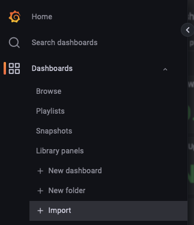

+++
draft = false
date = 2022-11-25T00:00:00+00:00
title = "Monitoring Rclone with Grafana and InfluxDB"
description = "In this post, we'll look at monitoring some important metrics from Rclone using Grafana, InfluxDB, and Telegraf."
slug = "rclone-grafana"
authors = ["tigattack"]
tags = ["monitoring", "grafana", "rclone"]
categories = ["technology"]
series = []
+++

In this post, we'll look at monitoring some important metrics from Rclone using Grafana, InfluxDB, and Telegraf.

I started looking into this after I followed a blog post that a good friend of mine recently published: [MonsterMuffin - Unlimited Plex Storage via Google Drive And Rclone](https://blog.muffn.io/unlimited-plex-storage-via-google-drive-and-rclone/).

Having a clear point of observation for these metrics is often invaluable when identifying and troubleshooting issues. It can also prove useful for tracking data usage over any given time span, identifying peak usage periods, and so on. Also, data is cool.

---


We'll be using [Rclone's `rc` mode](https://rclone.org/rc/) (remote control) for this, so, before we jump in, let's talk a little about that first.

Rclone exposes some handy metrics when running in `rc` mode, but we'll need a way to run Rclone like this.

In short, there are two clear ways of doing this:

1: Add the relevant `rc` flags to your existing service or script.  
2: Run Rclone `rcd` (rc daemon) as a service and configure your mounts etc. using `ExecStartPost` declarations. You could also use a script or something, but `ExecStartPost` is easy and does all we need here.

**Option 1** is very easy to get started with given Rclone's solid documentation for `rc`. You can basically be ready to go with the few additional parameters I'll cover in the next section.

However, the downside to this option is that for each Rclone command you run, whether this is in a service, in a script, or manually, you must specify a port that is not bound by an existing Rclone process, or any process for that matter.

This may sound obvious, but the result is that you will have to scrape multiple endpoints if you wish to gather metrics for more than one Rclone process. I'll cover this when we configure Telegraf later, should you wish to use this option.

While this may be a significant inconvenience for some of you, if you only have a single Rclone service, scheduled task, or other, this is a perfectly valid option and the one you should use.

**Option 2** is fantastic for unifying your metrics since all of your Rclone commands will be executed through a single process (i.e. this instance of `rcd`). As a result, all of your metrics will be available at a single endpoint.

You may have already noticed the downside; all of your Rclone commands must be executed through a single `rcd` instance for this to work.  
This means that any of your auxiliary scripts, daemons, etc. (for example, a scheduled upload script) that interface with Rclone will need to do so using `rclone rc` if you wish the metrics for these operations to be included in your metrics.

To clarify, you are still free to run traditional Rclone commands and you will suffer no issues; you will simply see no metrics from these commands at the configured metrics endpoint.

Whether this works for you will depend on your use case. Sometimes, `rc` commands are not particularly user-friendly. They're fine for scripts and services, but can make one-off commands quite difficult unless you're well experienced in its usage.

I'll be covering both of these options below, so pick your poison and keep reading!

---

# Configuring Rclone

I'm going to assume you are running Rclone as a systemd service, since that makes this a lot more straightforward.  
If you're not, there are many tutorials on how to do this, or you could just bastardise [MonsterMuffin's `gmedia.service` example](https://github.com/MonsterMuffin/rclone-gmedia/blob/main/services/gmedia.service).

You will need to edit your Rclone service file to add the following flags:

* Enable [Rclone remote control](https://rclone.org/rc/): `--rc`
* Enable the Rclone metrics endpoint: [`--rc-enable-metrics`](https://rclone.org/rc/#rc-enable-metrics)
* Bind to all interfaces on port 5572: [`--rc-addr=0.0.0.0:5572`](https://rclone.org/rc/#rc-addr-ip)

I highly recommend configuring authentication. Destructive actions are not possible without authentication, but there is scope for information gathering and potential inconvenience. You can see all rc commands and whether they require authentication [here](https://rclone.org/rc/#supported-commands).

You can use either of the following flags to enable HTTP authentication:
* Plaintext: `--rc-user=<username> --rc-pass=<password>`
* htpasswd file: `--rc-htpasswd=/path/to/htpasswd`

As I mentioned above, there are two routes you can take when configuring this; I've covered both below.

## Option 1 - Add Rclone `rc` to your existing setup

The first and simplest option is to simply add the flags above to your mount (or other) command.

Example command:
```shell
rclone mount --rc --rc-addr=0.0.0.0:5572 --rc-enable-metrics \
    --rc-user='username' --rc-password='password' \
    <your-remote>: /your/mount/point
```

See, I said this one was easy!


If you have multiple mounts, you can add these flags to all of them, but you will need to change the port since multiple processes cannot bind to the same port.



## Option 2 - Run Rclone `rcd` as a service

For this option, we'll look at running `rcd`. When you run `rclone rcd`, rclone will run as a daemon with the sole purpose of listening for `rc` commands.

You may remember what I said earlier about `rc` commands sometimes not being particularly user-friendly. They're fine for scripts and services, but can make one-off commands quite difficult unless you're experienced with `rc`.  Well, this is where you may see that.

In the second service definition below, you will notice that the global options are specified differently when using `rc`. Global options are exactly the same as Rclone's global flags in functionality, but all key:value pairs must be specified as JSON, and both the keys and values sometimes differ from the typical flags.

These differences can be difficult to work with in some cases. One such case I discovered is time values; these can typically be specified in shorthand (e.g. `1h`), but must be specified in nanoseconds when using `rc`, as seen in the example below.  
Note: I later found this to not always be the case, but, if anything, this inconsistency only worsens the matter.

You can find more information on this [here](https://rclone.org/rc/#data-types).

Some examples:
* Traditional flags become a JSON object: `--user-agent tig --timeout 1h` would become `--json {"main": {"UserAgent": "tig"}, "Timeout": 3600000000000}`.
* An example of some of the oddities: `--cache-mode full` becomes `{"vfs": {"CacheMode": 3}}`.

You can see all available options without needing to run `rcd` first like so:

```shell
rclone rc options/get --rc-user='username' --rc-pass='password'
```

In the standalone service definition below, we want to focus on 2 things:

1. `ExecStart` - This command launches Rclone's `rcd` using the specified configuration flags.

2. `ExecStop` - This command runs when you stop the service and will unmount all remotes.


```ini
[Unit]
Description=Rclone rcd service
After=network-online.target

[Service]
Type=notify
ExecStart=/usr/bin/rclone rcd \
	--rc-addr '0.0.0.0:5572' \
	--rc-enable-metrics \
	--rc-user 'username' \
	--rc-pass 'password' \
	--config '/path/to/your/rclone.conf' \
	--log-level 'INFO' \
	--log-file '/path/to/your/rcd.log'
ExecStop=/usr/bin/rclone rc --user 'username' --pass 'password' mount/unmountall
Restart=on-failure
RestartSec=5
StartLimitInterval=60s
StartLimitBurst=3
TimeoutStartSec=150

[Install]
WantedBy=multi-user.target
```


In this second service definition, I've added two `ExecStartPost` commands. `ExecStartPost` commands run after the `ExecStart` command has succeeded.  This method is a good way of launching `rcd` and almost instantly mounting your remote.

The first `ExecStartPost` sets various global Rclone options that cannot be defined with the `rc mount/mount` command, then the second `ExecStartPost` mounts the specified remote.


```ini
[Unit]
Description=Rclone rcd service with mount
After=network-online.target

[Service]
Type=notify
ExecStart=/usr/bin/rclone rcd \
	--rc-addr '0.0.0.0:5572' \
	--rc-enable-metrics \
	--rc-user 'username' \
	--rc-pass 'password' \
	--config '/path/to/your/rclone.conf' \
	--log-level 'INFO' \
	--log-file '/path/to/your/rcd.log' \
	--cache-dir '/path/to/optional/cache/dir'

# Set global opts
ExecStartPost=/usr/bin/rclone rc options/set \
	--rc-user 'username' --rc-pass 'password' \
	--json '{"main": {"UserAgent": "someuseragenthere", "Timeout": 3600000000000}, "mount": {"AllowOther": true}, "vfs": {"Umask": 2, "UID": 1000 , "GID": 1000, "PollInterval": 15000000000, "DirCacheTime": 3600000000000000, "CacheMaxAge": 129600000000000, "CacheMaxSize": 322122547200, "CacheMode": 3}, "log": {"File": "/var/log/rclone/rclone-mount.log"}}'

# Mount remote
ExecStartPost=/usr/bin/rclone rc mount/mount \
	--rc-user 'username' --rc-pass 'password' \
	fs=<your-remote>: mountPoint=/your/mount/point

ExecStop=/usr/bin/rclone rc --user 'username' --pass 'password' mount/unmountall
Restart=on-failure
RestartSec=5
StartLimitInterval=60s
StartLimitBurst=3
TimeoutStartSec=150

[Install]
WantedBy=multi-user.target
```


# Scraping the metrics

We're going to use Telegraf to scrape Rclone's `/metrics` endpoint.


For those of you who prefer Prometheus, Rclone's `/metrics` endpoint is Prometheus-compatible, so it will be pretty easy for you to get going with this too.


I won't cover installation of [InfluxDB](https://docs.influxdata.com/influxdb) or [Telegraf](https://docs.influxdata.com/telegraf/) since both are highly documented and have been covered by many other people.

You will need to either configure a new database in InfluxDB or use an existing one, depending on your preference, and note down the name.  
You will also need credentials for InfluxDB.


```toml
# InfluxDB to write metrics to
[[outputs.influxdb]]
  urls = ["http://<influx-host>:8086"]
  database = "<database>"
  username = "<username>"
  password = "<password>"

# Pull metrics from Rclone
[[inputs.prometheus]]
  # Single Rclone rc
  urls = ['http://<rclone-host>:5572/metrics']

  # Multiple Rclone rc
  # urls = ['http://<rclone-host>:5572/metrics','http://<rclone-host>:5573/metrics']

  # Rclone authentication
  username = "<username>"
  password = "<password>"
```



Simply replace the missing values, chuck this into your `telegraf.conf`, reload Telegraf, and you'll be good to go!

# Making data beautiful

Now for the fun and, for you, easy part!


I also won't cover the installation of Grafana since it is relatively simple and incredibly [well documented](https://grafana.com/docs/grafana/latest/).

## Create the data source

First of all, you must create a data source in Grafana for your InfluxDB database. You can find instructions for that in Grafana's documentation, [here](https://grafana.com/docs/grafana/latest/datasources/add-a-data-source/), but the process is something like this:

1. Navigate to Settings -> Data sources.
2. Select "Add data source"
3. Fill in the FQDN/IP and port of your InfluxDB instance.
4. Fill in the database name, username, and password.
5. Select HTTP method "GET"
6. Click "Save & test".

It should look something like this:





Hopefully you now have a nice green tick and you can continue to importing the dashboard!

## Import the dashboard

I've uploaded the dashboard to Grafana Dashboards, a great place for finding and sharing dashboards; you can find it [here](https://grafana.com/grafana/dashboards/17490).

To import a dashboard, click the dashboards button in the sidebar in Grafana, then "Import".





You can either import it into Grafana using the ID or download the JSON file, both found at the link above.

During the import process, you'll need to select the datasource you just created.

Once imported, you're good to go!

You'll notice there is a dropdown in the top left titled "Rclone". You can use this to select between multiple Rclone instances if you're scraping metrics from more than one.

## Done.

This dashboard has been pretty useful for me when troubleshooting or simply being curious about what's going on; I hope it can do the same for you.

If you wish to go the extra mile, one thought I had whilst writing this was that you could run `rcd` as a daemon, as per [option 2](#option-2---run-rclone-rcd-as-a-service) above, and then use Telegraf's [exec input plugin](https://github.com/influxdata/telegraf/tree/master/plugins/inputs/exec) to run commands such as `rclone rc operations/size`, `rclone rc cache/stats`, `rclone rc core/stats`, `rclone rc core/memstats`, and so on, then Telegraf will gather the JSON-formatted output and write it to InfluxDB.  

Although, at that point, you'd probably be better off writing your own script to gather, parse, and output the metrics for Telegraf.

Combined with Telegraf's [JSON parser](https://github.com/influxdata/telegraf/tree/master/plugins/parsers/json), this could be a very strong solution.

There would be a vast amount of information available with that method, but the one I've written about here is quite sufficient for my current needs.

Food for thought, at least.

Enjoy, and feel free to let me know if you have any suggestions or face any issues.

---

I always welcome feedback and questions. Please [contact me](/contact) if you have any.
