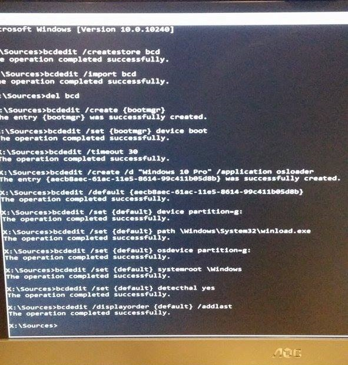

+++
draft = false
date = 2018-01-04T11:43:18+00:00
title = "Rebuilding the BCD with BCDEdit"
description = "BCD stands for Boot Configuration Data. The BCD file lives in a folder called \"boot\" on the active partition of your hard drive. It contains information that instructs the computer on how to load the OS."
featuredImage = "header.jpg"
slug = "rebuilding-the-bcd-with-bcdedit"
aliases = ["/rebuilding-the-bcd-with-bcdedit"]
authors = ["tigattack"]
tags = []
categories = ["technology"]
series = []
+++

The BCD file lives in a folder called "boot" on the active partition of your hard drive. It contains information that instructs the computer on how to load the OS.  
A working BCD file usually has at least two things: 1) One or more OS entries and 2) the Boot Manager, which contains general boot info such as which OS to boot by default and, when more than one OS is present,
the amount of seconds to wait for user input.  
So if your computer cannot locate this information then chances are it either doesn't exist or it's corrupted, therefore the computer will not know how or what to boot.

Unfortunately it's not unheard of for the BCD to become corrupted one way or another. That's why I've made this post.


BCD stands for Boot Configuration Data.


Small disclaimer: While this has always worked for me, I cannot guarantee it'll work for you. I take no responsibility if this breaks your computer or sets your cat on fire.

---

First of all what you need to do is boot your computer from your recovery/install media. This may be the disc you used to install Windows on your computer or a CD or USB stick that came with your computer when you bought it.  
Once you've booted from that, open a command prompt. You can find out how to do this on your version of Windows using Google.

Before we do anything else you need to find out which volume your OS is installed on.  
To do this run these commands:

<pre class="language-shell">
<code>> diskpart
> list volume
</code></pre>

Find the volume that matches the size and label of the volume that Windows is installed on and remember the letter, you'll need it later.
This can be found in the "Ltr" column of the output of the command.  
Now run `exit` to leave the DISKPART utility.

So after you've got the OS volume letter you need to create a new, empty BCD file using these two commands:

<pre class="language-shell">
<code>> bcdedit /createstore bcd
> bcdedit /import bcd
</code></pre>

Then delete the old one:

<pre class="language-shell">
<code>> del bcd
</code></pre>

Now what you need to do is create a part of the BCD file known as the Boot Manager

<pre class="language-shell">
<code>> bcdedit /create {bootmgr}
</code></pre>

There isn't much else you need to do with the Boot Manager but it does need to know what volume to boot the OS from and how long to wait for user input on the OS choice screen. Replace 30 with the amount of seconds you want it to wait. If you're not sure what to do, just use 30 as that is the default.

<pre class="language-shell">
<code>> bcdedit /set {bootmgr} device boot
> bcdedit /timeout 30
</code></pre>

After you've created and configured the boot manager, as above, you need to create the OS entry object in the BCD file. This will tell the boot manager to boot Windows from files in the \Windows folder on one of the systems volumes.  
So run this command:

<pre class="language-shell">
<code>> bcdedit /create /d "Your OS name here (e.g. Windows 10 Pro)" /application osloader
</code></pre>

The command you just ran will spit out a response that looks something like this:  
`The entry {aecb8aac-61ac-11e5-8614-99c411b05d8b} was successfully created.`

The GUID (the bit that looks like
`{aecb8aac-61ac-11e5-8614-99c411b05d8b}`) will need to be used in to the next command.

<pre class="language-shell">
<code>> bcdedit /default {GUID-HERE}
</code></pre>

So now the object needs some values in it so it knows what to do. To get a rough idea for these next commands, try and run the command "`bcdedit`" on a healthy computer and use the output from that as a model. In my case the OS volume was C, so I entered these:

<pre class="language-shell">
<code>> bcdedit /set {default} device partition=c:
> bcdedit /set {default} path \windows\system32\boot\winload.exe
> bcdedit /set {default} osdevice partition=c:
> bcdedit /set {default} systemroot \Windows
> bcdedit /set {default} detecthal yes
</code></pre>

Lastly you must run this command so that your computer can see your OS when booting:

<pre class="language-shell">
<code>> bcdedit /displayorder {default} /addlast
</code></pre>

Here is the output from my friends computer when I fixed his corrupted BCD. Sorry for the potato quality!  

---

I always welcome feedback on my posts, please [contact me](/contact) if you have any. I'm also happy to answer any related questions if I know the answer.
