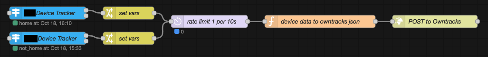

Last time I wrote about self-hosting my location history, I settled on [OwnTracks](https://owntracks.org/), an open-source project for location tracking & sharing.

I found OwnTracks to be a nice solution, but it's quite primitive compared to Google Timeline. The [OwnTracks frontend](https://github.com/owntracks/frontend) feels like a proof of concept; I ran into several notable bugs, it's in sore need of considerable optimisation[^1] in some areas, and I felt that quite a few seemingly obvious & simple features were either underdeveloped or nonexistent.

Some of these issues were clear from the beginning (in fact some were mentioned in the summary at the end of my [previous post](/posts/selfhost-location-history)), whilst others were less obvious and only showed themselves after some time or in specific scenarios.

A good friend of mine, Muffin, also trialled OwnTracks after I wrote about it and discussed it with him. He wrote about his experience in [his de-Googling post](https://blog.muffn.io/posts/de-googling/#-location-tracking) (a great read overall) and found many of the same issues as I.

With that said, I wish to state that I don't believe this should reflect poorly on the OwnTracks project. They've done some incredible work and the future of my self-hosted location history solution is still likely to include parts of their tooling. Bugs aside, it is simply a matter of their front- and back-end solutions not being suitable for my desired use case.

For the aforementioned reasons, I started looking for other potential solutions. My requirements remained pretty much the same as before:

> I'm a forgetful person and find it really useful to be able to hop into my Google location history to remember where I was on a given day, re-discover a great place I visited on a trip, and so on. The monthly reports were also pretty nice, providing a breakdown of locations visited and an analysis of travel (type, distance, duration, etc.)

# The New Solution

After looking at a few different options, I discovered [Dawarich](https://dawarich.app/).

Dawarich is an open-source project that sells itself as a "self-hostable alternative to Google Timeline", focusing on privacy and data ownership — Sounds perfect!

It's a much newer project than OwnTracks and is yet to see a v1.x release, but this shouldn't put you off. I've been using it since mid-2024, not long after the first release, and wholeheartedly recommend it. As you may've seen in Muffin's post linked above, he started trialling it not long after me and was also quite happy with it (he did have some gripes, but some of these are no longer valid; there have been >30 feature releases since he wrote about it).

Dawarich is miles beyond OwnTracks in terms of features, and is far closer to being a true open-source, self-hostable version of Google Timeline than anything else I've seen or tried.

Its interactive map has a lot of useful features, from the simpler points, polylines, and heatmap views, to the more advanced photo overlays (made possible via PhotoPrism and Immich integrations), custom area overlays, and several choices of map style (normal OSM, satellite, topographic, public transport, cycling, streets, etc.).

It touts many other impressive features, including but not limited to:

- Visits log, including visit suggestions, computed by reverse geocoding your location history!
- A trips section for travel journaling
- PhotoPrism and Immich integration (as mentioned before)
- A comprehensive API
  - Including support for multiple different API formats (OwnTracks, Overland) when ingesting geopoints
- A complete import/export system which supports many file formats
- A statistics view, my favourite of all.

The stats view is a really nice way to see your history over time in numbers. It provides a clear interface with nice, big, all-time totals at the top and breakdowns of your yearly movements below.

You can drill down into each year to get a more detailed overview of the yearly totals and a monthly breakdown, and from there into each month to see a heatmap (points view also available), daily breakdown, and country & city visits list.


  
  
  


## Live Location Updates

Dawarich has an OwnTracks-compatible API endpoint for location reporting. This means I was able to continue to use the same solution I designed for Owntracks:

> Since I already run [Home Assistant](https://www.home-assistant.io), I saw no point in running the OwnTracks app on my partner and I's phones when the Home Assistant app already reports our locations. Instead, I decided it made far more sense to just publish location updates from Home Assistant to OwnTracks with an HTTP request. 
> This was simple to do with Node-RED. You can find my Node-RED flows in [this GitHub Gist](https://gist.github.com/tigattack/73be9f9df722b546c6ad4785957bd813).
> 

However, I am not happy with this solution. It's highly susceptible to data loss in limited- or no-data scenarios since the Home Assistant Companion does not support offline caching of geopoints — Instead, it takes the simple approach of send (or _try_ to send) and done. This is unlike the OwnTracks app, which does support offline caching of collected points.

The same is true of the Node-RED flow; if Dawarich is unavailable, or if there is any loss of connectivity between Home Assistant & Dawarich, one or more geopoints will be lost forever. I'm sure I could implement some workarounds for this, but I have something else in mind...

While on holiday some time ago, Muffin and I discussed this, and I came up with a possible solution. What I wish to build is a simple server that implements the OwnTracks API and can redistribute incoming updates to one or more endpoints (i.e. Dawarich and Home Assistant, in my case). It should also support request retries and optional local storage of incoming requests.

With this solution in place, I would then switch from the Home Assistant Companion to the OwnTracks app for location reporting.

The result of all this would be a robust geolocation pipeline with caching and retries at each stage, whilst maintaining full functionality and ease-of-use across my smartphone, Home Assistant, and Dawarich.

This is currently little more than an idea, but I do have a simple proof of concept up and running. It's not in daily use and, to be honest, I haven't worked on it in a while, but I'm still excited about the idea and intend to pursue it when time allows.

My rambling notions of geolocation pipelines aside, I would be remiss if I were not to mention that Dawarich now has an [official iOS app](https://dawarich.app/docs/dawarich-for-ios/). This is pretty exciting. Hopefully we'll also see an Android app one day.

## Getting Started

Unlike my previous post, I won't go into great detail on how to get up and running with Dawarich. Dawarich's getting started documentation is clear and simple to follow.

See the [Dawarich Intro](https://dawarich.app/docs/intro#setup-your-dawarich-instance) for setup instructions.

If you happen to use Ansible, I've also published an Ansible role to deploy Dawarich in Docker ([GitHub](https://github.com/tigattack/ansible-role-dawarich)).

## Migrating Location History

As above, there is no new information for me to document here — Dawarich has all of this covered in their docs.

On their "[Import existing data](https://dawarich.app/docs/tutorials/import-existing-data)" page, they demonstrate how to import data from Google Timeline, OwnTracks, GPX files, and more.

As an aside, moving to Dawarich actually highlighted just how much of my location history was riddled with anomalous moves and incorrect points. I first realised this when I saw incredibly high figures on the stats page, with some years having a total travel distance of hundreds of thousands of miles.

To help solve this, I created a Python script that interacts with the Dawarich API and detects anomalous movements between consecutive geopoints.

The script and documentation can be found in [this gist](https://gist.github.com/tigattack/12be4ed1d3b2557f4cb05d0d947fa4cc). It's no one-shot fix, but it helps a lot.

# Summary

As much as I appreciated OwnTracks for being my stepping stone away from willingly handing my every move to Google, I quickly outgrew it.

Even though Dawarich was a very new project and therefore quite understandably imperfect at the time, I was over the moon when I discovered it.

In the year and a half since then, Dawarich has come leaps and bounds. There have been some frustrations along the way, nothing is ever perfect, but it's been quite an experience to see it grow into what it is now; a very impressive piece of software even in its pre-v1 release stages. Truly a huge credit to its creator, [Freika](https://github.com/Freika).

As [described above](#live-location-updates), there's still a lot I wish to change in my solution overall. I'll be sure to write a follow-up to this once I'm happy with my solution.

---

I always welcome feedback on my posts; please [contact me](/contact) if you have any.  
I'm also happy to answer any related questions if I know the answer.

[^1]: The frontend would become noticeably sluggish when viewing map traces of my location history over durations as little as a few weeks. Longer time spans such as months or years would render it entirely unresponsive. When viewing traces over time, every single geo-point in the given time range is queried from the OwnTracks Recorder (backend) and rendered in the browser. No reduction of the dataset is performed, so this hits both the backend and frontend pretty hard, requiring vast datasets to be selected, returned, and rendered.