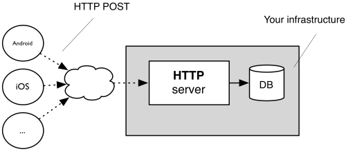



# The Problem

Sending my exact location to Google by the minute has never made me very comfortable, but it was something I accepted as a trade-off for the benefits I saw by doing so.

I'm a forgetful person and I found it really useful to be able to hop into my Google location history to remember where I was on a given day, re-discover a great place I visited on a trip, and so on. The monthly reports were also pretty nice, providing a breakdown of locations visited and an analysis of travel (type, distance, duration, etc.)

These are all features I would struggle to go without, but after 10 years, I felt it really was time to stop passing all this data to Google.

Enter Owntracks...

# The Solution

[Owntracks](https://owntracks.org) is an open-source project for location tracking, consisting of a mobile app (Android/iOS) and a self-hosted backend server (optional).

* The backend server, known as the "Recorder", consumes the client's location from an MQTT broker or HTTP POST request.
* The mobile app publishes its location via MQTT or HTTP periodically or based on any of a number of optional triggers (geo-fences, significant location changes, manual updates, etc.)



_Owntracks architecture overview. Source: https://owntracks.org/booklet/guide/whathow_


If you choose to use MQTT, you only need to expose your MQTT broker to the internet if you want real-time tracking. Otherwise, the Owntracks mobile app will cache location records until it can reach the broker.


Since location data can be sent to the Recorder via MQTT or HTTP, there is actually no requirement to use the mobile app and, in my case, I've decided against it for reasons I will explain in the next section.

Owntracks has some other nice features such as sharing with friends and posting extended metrics beyond just location to the Recorder (battery state, charging state, connection type, etc.)  

I won't dive into Owntracks' feature set any more, but you can read more about it on their [docs page](https://owntracks.org/booklet).

## How I'm Using It

Since I already run [Home Assistant](https://www.home-assistant.io), I saw no point in running the Owntracks app on my partner and I's phones when the Home Assistant app already reports our locations. Instead, I decided it made far more sense to just publish location updates from Home Assistant to Owntracks with an HTTP request.

This was simple to do with Node-RED and, since Owntracks wants the same JSON format whether MQTT or HTTP is being used, the same flow could be used to post this data to MQTT with very few changes. You can find my Node-RED flows for HTTP and MQTT in [this GitHub Gist](https://gist.github.com/tigattack/73be9f9df722b546c6ad4785957bd813).

## Setting Up

Whether you wish to use the mobile app or not, you will need to run the Recorder.

The Recorder has a very simple web interface which is useful during setup, testing, and debugging, but it's not a particularly nice way to view location history.

For a nicer way to browse through your location history, you can deploy the Owntracks Frontend, a single-page Vue.js application. This is what you see in this post's header image.

Here's an example of the most simple deployment with Docker Compose:
```yml
version: '3'
services:
  owntracks-recorder:
    image: owntracks/recorder
    restart: unless-stopped
    ports:
      - 8083:8083
    volumes:
      - /path/to/location-store:/store

  owntracks-frontend:
    image: owntracks/frontend
    restart: unless-stopped
    ports:
      - 80:80
    environment:
      SERVER_HOST: recorder
      SERVER_PORT: 8083
```


This example doesn't include a MQTT broker. If you wish to use MQTT instead of HTTP and you do not already have a MQTT broker, the link for Docker Compose examples below includes a deployment with a MQTT broker.


Here are some handy links for these components:

* Running, configuring, and using the Recorder and related utilities in the [owntracks/recorder](https://github.com/owntracks/recorder) GitHub repository
* Further Docker Compose examples and setup info for the Recorder in the [owntracks/docker-recorder](https://github.com/owntracks/docker-recorder) GitHub repository
* Running, configuring, and using the frontend in the [owntracks/frontend](https://github.com/owntracks/frontend) GitHub repository

## Migrating Google Location History

Once you have the Recorder setup and running, you may want to import your location history from Google as I did.

This is a surprisingly simple process thanks to an Owntracks contributor who supplied a [Python script](https://github.com/owntracks/recorder/tree/master/contrib/google-import) to parse the location records from Google Takeout and push them to Owntracks via MQTT.  
Yes, via MQTT... that's the one caveat of this process; it requires an MQTT broker. However, you needn't continue to run this after performing the import if you don't wish to.

Here's a Docker Compose example of how you can set up a MQTT broker alongside the Owntracks Recorder:

```yml
version: '3'
services:
  owntracks-recorder:
    image: owntracks/recorder
    restart: unless-stopped
    ports:
      - 8083:8083
    volumes:
      - /path/to/location-store:/store
    environment:
      # This environment variable tells the recorder where the MQTT broker is.
      # If you already have a broker set up, see this link for more options such as user, pass, port, etc. https://github.com/owntracks/recorder#configuration-file
      OTR_HOST: mosquitto

  mosquitto:
    image: eclipse-mosquitto
    ports:
      - 1883:1883
    volumes:
      - /path/to/mosquitto.conf:/mosquitto/config/mosquitto.conf
```

And here is a simple `mosquitto.conf` you can use for this purpose:
```conf
listener 1883 0.0.0.0
allow_anonymous true
```


This `mosquitto.conf` allows full permissions to anyone with network access to the broker. It should **not** be used in production.


### Import Process

1. Go to [Google Takeout](https://takeout.google.com), deselect all options except "Location History", and generate an export.
2. Once the Google Takeout export has been generated, download and extract it.
3. Grab the `google-import.py` script from [here](https://github.com/owntracks/recorder/tree/master/contrib/google-import)  
4. Follow the instructions in the [README](https://github.com/owntracks/recorder/blob/master/contrib/google-import/README.md) file at the script link above to import your Google history to Owntracks.


You can also run `python3 google-import.py -h` to see usage information.  
This is the command I used: `python3 google-import.py google_export/Records.json --tid tg -t owntracks/tig/gs21u -u owntracks -P password -H localhost:1883`


# Summary

I've found Owntracks to be a really nice solution, and I couldn't be happier to no longer be providing Google with my every move.

Overall I'm a happy user and will continue to utilise Owntracks. However, as with many solutions, there are unfortunately a few caveats.

Let's finish by having a look at the pros and cons of Owntracks (as opposed to other solutions) that I've discovered during the couple of weeks I've been using it.

**Good:**
* Supports HTTP POST and MQTT.
* All server components can be run in containers.
* The frontend is simple to use, well-designed from a UI perspective, has some cool features such as location heatmaps, and works amazingly for viewing location history over a small time-range.

**Bad:**
* Documentation is a little lacking in some areas.
* I've seen people say they feel the Recorder is overly complex and difficult to use, but I personally found it to be incredibly simple, as I hope to have demonstrated here.
* When viewing location history over a longer time-range in the frontend, I found it became very slow and, at a certain point, entirely unusable. Anything up to a couple of weeks is fairly snappy and shouldn't cause issues, but loading more than a month or two of location history can cause it to really drag.  
  Really, this is a poor representation of the problem; time is a bad metric for this sort of issue, as the core problem is the amount of location data being loaded in and rendered on the map. It entirely depends on your level of activity (how often and how far you're travelling), so YMMV.

---

I always welcome feedback on my posts; please [contact me](/contact) if you have any.  
I'm also happy to answer any related questions if I know the answer.
