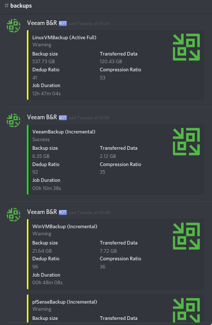

+++
draft = false
date = 2018-01-08T10:16:31+00:00
title = "Discord notifications: Veeam Backup & Replication"
description = "Part 2 of a Discord notifications series.  Part 1 details notifications for Sonarr, Radarr and Lidarr.  In a similar fashion to part 1, this setup has been running for a while and I'm very pleased with it's flawless functionality."
slug = "veeam-b-r-notifications-in-discord"
aliases = ["/veeam-b-r-notifications-in-discord"]
authors = ["tigattack"]
tags = []
categories = ["technology"]
series = ["Discord Notifications"]
+++

Part 2 of a [Discord notifications series](#see-also-in-discord-notifications).

In a similar fashion to part 1, this setup has been running for a while and I'm very pleased with it's flawless functionality.


This project is no longer maintained; it has been superseded by my new project, [VeeamNotify](https://github.com/titgattack/VeeamNotify).  
You can read more about it [here](../veeamnotify).


---

# Background

I started off by attempting to make my own scripts for this, but that didn't go so well, so I tried again.

Attempt 2 was using some of my own code and some code from scripts I found on the internet.  
I thought this was running well as it looked good from the reports I was seeing.   
A couple of months down the line I had a look in the logs, reviewed my scripts, and realised it was actually an absolute mess and frankly quite shit.

I've now found a set of scripts that do what I did better and have forked [the project](https://github.com/TheSageColleges/VeeamSlackNotifications) to make a number of [my own improvements](https://github.com/tigattack/VeeamSlackNotifications).

As of 06/12/2018, I've adapted it for Discord and re-released it under it's [own repository](https://github.com/tigattack/VeeamDiscordNotifications).

If I were Tim Cook, I would tell you that the project has been reinvented.

## Update (01/02/2019):

I will keep these instructions updated and in-line with current release as much as possible, but if something is out of date then please [contact me](/contact/).

---

# Setup

## 1. Make a scripts directory

The directory should be `C:\VeeamScripts`.  
To make the directory run the following command in PowerShell:

<pre class="language-powershell">
<code>New-Item C:\VeeamScripts -Type directory
</code></pre>

## 2. Download the project

There may be later releases so [take a look](https://github.com/tigattack/VeeamDiscordNotifications/releases)
and replace the version number in the commands below with the latest if applicable.

<pre class="language-powershell">
<code>Invoke-WebRequest -Uri 'https://github.com/tigattack/VeeamDiscordNotifications/releases/download/v1.5/VeeamDiscordNotifications-v1.5.zip' -OutFile 'C:\VeeamScripts\VeeamDiscordNotifications-v1.5.zip'
</code></pre>

You may recieve an SSL error as in some cases winhttp uses TLS1 by default (depends on a few things), and GitHub appears to no longer accept TLS1. If you receive this error, run the following command and then re-issue the above command.

<pre class="language-powershell">
<code>[Net.ServicePointManager]::SecurityProtocol = [Net.SecurityProtocolType]::Tls12
</code></pre>

## 3. Extract and clean up

<pre class="language-powershell">
<code>Expand-Archive C:\VeeamScripts\VeeamDiscordNotifications-v1.5.zip -DestinationPath C:\VeeamScripts
Rename-Item C:\VeeamScripts\VeeamDiscordNotifications-v1.5 C:\VeeamScripts\VeeamDiscordNotifications
Remove-Item C:\VeeamScripts\VeeamDiscordNotifications-v1.5.zip
</code></pre>

You've now extracted the release and cleaned up the download.

## 4. Create a Discord webhook

Open Discord and go to the settings of the channel that you want Veeam to report to. I created a channel called "backups" for this service.

Click "Edit Channel", then navigate to the "Webhooks" section and click "Create Webhook". You'll see something similar to the following:

As you can see mine has already been configured, but all you need to do is set the name, upload an image for the avatar if you'd like, then copy the webhook URL.

If you'd like to use the avatar that I used, [here it is.](https://raw.githubusercontent.com/tigattack/VeeamDiscordNotifications/master/asset/thumb01.png)

## 5. Prepare for use

Open the configuration file:

<pre class="language-powershell">
<code>notepad.exe C:\VeeamScripts\VeeamDiscordNotifications\config\conf.json
</code></pre>

Older versions of Notepad don't support LF line endings, so this file may look pretty fucked up, but it doesn't really matter in this case. All you have to do here is replace the webhook URL with your own from step 3. Just make sure you replace *only* the Discord URL and nothing else.

You may also need to set your PowerShell execution policy to Unrestricted.

<pre class="language-powershell">
<code>Set-ExecutionPolicy Unrestricted
</code></pre>

If you don't want to do that, replace the script path in section 5 below with the following

<pre class="language-powershell">
<code>Powershell.exe -ExecutionPolicy Bypass -File C:\VeeamScripts\VeeamDiscordNotifications\DiscordNotificationBootstrap.ps1
</code></pre>

Unblock the script files. The reason you may need to do this is Windows often blocks execution of downloaded scripts.

<pre class="language-powershell">
<code>Unblock-File C:\VeeamScripts\VeeamDiscordNotifications\DiscordNotificationBootstrap.ps1
Unblock-File C:\VeeamScripts\VeeamDiscordNotifications\DiscordVeeamAlertSender.ps1
Unblock-File C:\VeeamScripts\VeeamDiscordNotifications\resources\logger.psm1
</code></pre>

## 6. Configure in Veeam

Repeat this for each job that you want to be reported into Discord.

* Right click the job and click "Edit".
* Go to the "Storage" section and click on the "Advanced" button.
* Go to the "Scripts" tab and configure as shown below.

<pre class="language-powershell">
<code>Powershell.exe -File C:\VeeamScripts\VeeamDiscordNotifications\DiscordNotificationBootstrap.ps1
</code></pre>

Success! *Hopefully.*  
Run a job and find out. This is what mine looks like.

---

# Updates

## [15/02/2018](https://github.com/tigattack/VeeamSlackNotifications/releases/tag/v2.0)

I've made a number of improvements to the way backups are reported, resulting in reports that look better and are much easier to understand.

## [15/02/2018](https://github.com/tigattack/VeeamSlackNotifications/releases/tag/v2.1)

Minor changes, mostly to config template.

## [19/02/2018](https://github.com/tigattack/VeeamSlackNotifications/releases/tag/v2.2)

Fixed transferred data and total data stats.  
Embarrassingly basic error.

## [16/11/2018](https://github.com/tigattack/VeeamSlackNotifications/releases/tag/v2.3)

Changed name of configuration file and cleaned up the alert sender.

## [30/11/2018](https://github.com/tigattack/VeeamSlackNotifications/releases/tag/v2.4)

Fixed bugs introduced in the last release and updated instructions.

## [06/12/2018](https://github.com/tigattack/VeeamDiscordNotifications/releases/tag/v1.0)

Adapted my other project
([VeeamSlackNotifications](https://github.com/tigattack/VeeamSlackNotifications))
for Discord with various improvements and Discord-specific changes.

## [01/02/2019](https://github.com/tigattack/VeeamDiscordNotifications/releases/tag/v1.5)

This release adds the job's processing speed to the report, adds an update checker, and brings an option (disabled by default) to mention the specified Discord user when a job fails.

---

If you have any problems with the script, please [open an issue](https://github.com/tigattack/VeeamDiscordNotifications/issues/new?assignees=&labels=bug&template=bug_report.md&title=%5BBUG%5D+)
on the GitHub project.

I always welcome feedback on my posts, please [contact me](/contact) if you have any. I'm also happy to answer any related questions if I know the answer.
