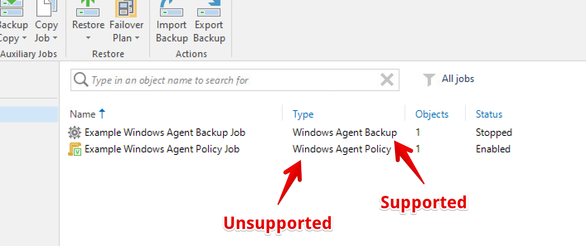
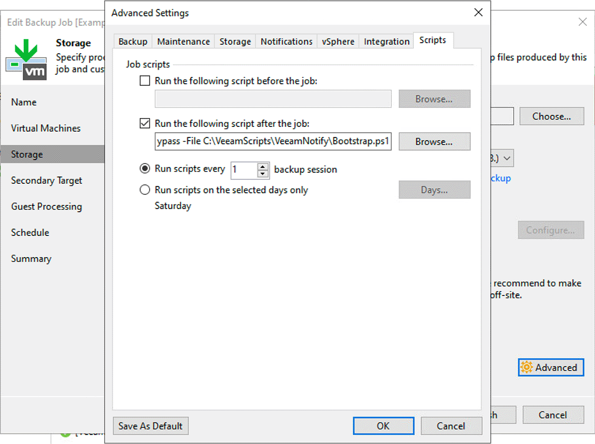

+++
draft = false
date = 2022-06-28T00:09:55+01:00
title = "VeeamNotify -  Veeam B&R session notifications"
description = "VeeamNotify sends Veeam Backup & Replication session summary notifications to Discord, Microsoft Teams, and Slack, detailing the session result and various statistics."
slug = "veeamnotify"
aliases = ["/veeamnotify"]
authors = ["tigattack"]
tags = ["project", "PowerShell"]
categories = ["technology"]
series = []
+++

VeeamNotify sends Veeam Backup & Replication session summary notifications to Discord, Microsoft Teams, and Slack, detailing the session result, various statistics, and optionally alerting you via @mention when a job finishes in a warning or failed state.

VeeamNotify is a replacement for my previous [VeeamDiscordNotifications](https://github.com/tigattack/VeeamDiscordNotifications) project, and the respective [Teams](https://github.com/tigattack/VeeamTeamsNotifications) and [Slack](https://github.com/tigattack/VeeamSlackNotifications) projects. You may have seen my [previous blog post](https://blog.tiga.tech/veeam-b-r-notifications-in-discord/) about VeeamDiscordNotifications.

VeeamNotify features improvements across the board and support for all the aforementioned messaging services in one place.

---


# VeeamNotify Compatibility

Supported Notification Services:

* Discord
* Slack
* Microsoft Teams

Please create a [feature request](https://github.com/tigattack/VeeamNotify/issues/new?assignees=tigattack&labels=enhancement&template=feature_request.yml&title=[FEAT]+New+service:+) if your preferred service isn't listed here.

Supported Veeam Job Types:

* VM Backup
* VM Replication
* Windows & Linux Agent Backup jobs*

Due to limitations in Veeam, only some types of Agent jobs are supported:

* **Supported** jobs are referred to as "Agent Backup" or "Managed by backup server".  
* **Unsupported** jobs are referred to as "Agent policy" or "Managed by agent".  





You can read about the difference between these two Agent job types [here](https://helpcenter.veeam.com/docs/backup/agents/agent_job_protection_mode.html?ver=110#selecting-job-mode).

Unfortunately, even supported Agent jobs return a reduced amount of session information, so you won't see as much detail in the notification (see the example screenshots at the top).

I've included as much relevant information as I've been able to discover in the notifications, but I welcome any suggestions for improvement in this area.


# Manual Install Instructions

If you're not here for manual installation instructions, I suggest you have a look at some simpler installation methods in the [VeeamNotify wiki](https://github.com/tigattack/VeeamNotify/wiki).


I will keep these instructions updated and in-line with current release as much as possible, but if something is out of date then please submit an issue in the [GitHub repository](https://github.com/tigattack/VeeamNotify).


## Requirements

* Veeam Backup & Replication 11 or higher.
* PowerShell 5.1 or higher.

## Preparation

Before you do anything else, I suggest you prepare the notification service(s) you wish to use. The process is different for all of them, so I've provided some basic steps in the [VeeamNotify wiki](https://github.com/tigattack/VeeamNotify/wiki).

At the time of writing, `v1.0` is the latest version, so that's what we'll install. There may be more recent releases by the time you're reading this, so [take a look](https://github.com/tigattack/VeeamNotify/releases) and replace the version number in the following commands if necessary.

The install directory is `C:\VeeamScripts` by default. You can use any directory you wish, but the user under which Veeam runs must have read/write access to it.

Firstly, open PowerShell as administrator and leave it open. We'll be using it through the process.

Now we need to create the install directory. Run the following command to do this:

```powershell
New-Item 'C:\VeeamScripts' -Type Directory
```

## Download VeeamNotify

The first command, in simple terms, instructs PowerShell to use TLS 1.2 for web requests. It uses TLS 1.0 by default, which GitHub no longer accepts.

The second command downloads the VeeamNotify v1.0 release ZIP.

```powershell
[Net.ServicePointManager]::SecurityProtocol = [Net.SecurityProtocolType]::Tls12
Invoke-WebRequest -Uri https://github.com/tigattack/VeeamNotify/releases/download/v1.0/VeeamNotify-v1.0.zip -OutFile C:\VeeamScripts\VeeamNotify-v1.0.zip
```

## Extract and Clean Up

You can now extract the release and remove the downloaded ZIP:

```powershell
Expand-Archive 'C:\VeeamScripts\VeeamNotify-v1.0.zip' -DestinationPath 'C:\VeeamScripts'
Rename-Item 'C:\VeeamScripts\VeeamNotify-v1.0' 'C:\VeeamScripts\VeeamNotify'
Remove-Item 'C:\VeeamScripts\VeeamNotify-v1.0.zip'
```

Windows typically blocks execution of downloaded scripts, so we need to unblock all the script files for this project:

```powershell
Get-ChildItem -Path 'C:\VeeamScripts\VeeamNotify' -Filter '*.ps*' -Recurse | Unblock-File
```

## Configure VeeamNotify

Open the configuration file:

```powershell
notepad.exe C:\VeeamScripts\VeeamNotify\config\conf.json
```


Old versions of Notepad don't support Unix-style line endings, so this file may look pretty fucked up. Try using another editor if Notepad is proving too difficult.


The primary points of configuration here are webhooks, so make sure you add the webhook(s) of the service(s) you wish to notify.  
I'll provide no specific instructions beyond that; how you configure VeeamNotify is entirely your choice.

If you need some help, check out the [configuration reference](https://github.com/tigattack/VeeamNotify/wiki/%E2%9A%99%EF%B8%8F-Configuration-Options).


## Configure Veeam

Firstly, we must generate the launch command to ensure you provide Veeam with the correct path to the PowerShell executable.

Run the following command:

```powershell
"$((Get-Command -Name 'powershell.exe' -ErrorAction Stop).Path) -NoProfile -ExecutionPolicy Bypass -File 'C:\VeeamScripts\VeeamNotify\Bootstrap.ps1'"
```

This should return something like this:

```powershell
C:\Windows\System32\WindowsPowerShell\v1.0\powershell.exe -NoProfile -ExecutionPolicy Bypass -File 'C:\VeeamScripts\VeeamNotify\Bootstrap.ps1'
```

Copy that output, then repeat the following steps for each job that you want to be notified about:

1. Right-click the job, then select "Edit"
2. Go to the "Storage" tab
3. Select "⚙️ Advanced"
4. Go to the "Scripts" tab and configure like this:
    * Check "Run the following script after the job".
    * Paste the launch command we generated above.
    * Ensure "Run scripts every X backup session" is set to 1.
      

5. Click "OK", then click "Finish".

## Fin.

All done! Start a job to test your installation.

Here are some example notifications:


  
  


If you have any problems with the script, please [open an issue](https://github.com/tigattack/VeeamNotify/issues/new?assignees=tigattack&labels=bug&template=bug_report.yml&title=[BUG]+) on the GitHub project.

---

I always welcome feedback on my posts; please [contact me](/contact) if you have any.  
I'm also happy to answer any related questions if I know the answer.
